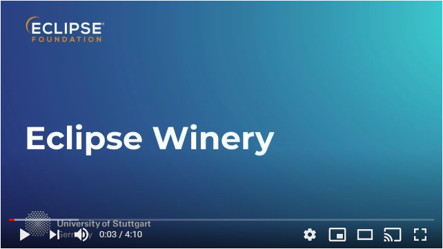

# Eclipse Winery

Winery is a web-based environment to graphically model TOSCA topologies and plans managing these topologies.
It is an Eclipse project and thus support is available through its project page <https://eclipse.org/winery>.
Winery is also part of the OpenTOSCA ecosystem where more information is available at <http://www.opentosca.org>.

**The code and the linked libraries are NOT approved by Eclipse Legal.**

There was no software security check of Eclipse Winery in the past.
There might be [remote code execution vulnerabilities](https://github.com/mbechler/marshalsec). 
Thus, when hosting Eclipse Winery, make it accessible to trustworthy parties only.

## Getting Started

Both development and user documentation is available at <https://eclipse.github.io/winery>.
The source for the documentation can be found in the [docs](docs) directory.

## Video

## Acknowledgements

The initial code contribution has been supported by the [Federal Ministry for Economic Affairs and Energy] as part of the [CloudCycle] project (01MD11023).
Current development is supported by the Federal Ministry for Economic Affairs and Energy as part of the projects [SmartOrchestra] (01MD16001F) and [SePiA.Pro] (01MD16013F), as well as by the [DFG] (Deutsche Forschungsgemeinschaft) projects [SustainLife] (641730) and [ADDCompliance] (636503).
Further development is also funded by the European Union’s Horizon 2020 project [RADON].

## License

Copyright (c) 2012-2021 Contributors to the Eclipse Foundation

See the NOTICE file(s) distributed with this work for additional
information regarding copyright ownership.

This program and the accompanying materials are made available under the
terms of the Eclipse Public License 2.0 which is available at
http://www.eclipse.org/legal/epl-2.0, or the Apache Software License 2.0
which is available at https://www.apache.org/licenses/LICENSE-2.0.

SPDX-License-Identifier: EPL-2.0 OR Apache-2.0

  [CloudCycle]: http://www.cloudcycle.org/en
  [Federal Ministry for Economic Affairs and Energy]: http://www.bmwi.de/EN
  [Scalable JavaScript Application Architecture]: http://www.slideshare.net/nzakas/scalable-javascript-application-architecture-2012
  [SmartOrchestra]: http://smartorchestra.de/en
  [SePiA.Pro]: http://projekt-sepiapro.de/en
  [ADDCompliance]: http://addcompliance.cs.univie.ac.at
  [SustainLife]: http://www.iaas.uni-stuttgart.de/forschung/projects/SustainLife
  [RADON]: http://radon-h2020.eu
  [DFG]: http://www.dfg.de/en
