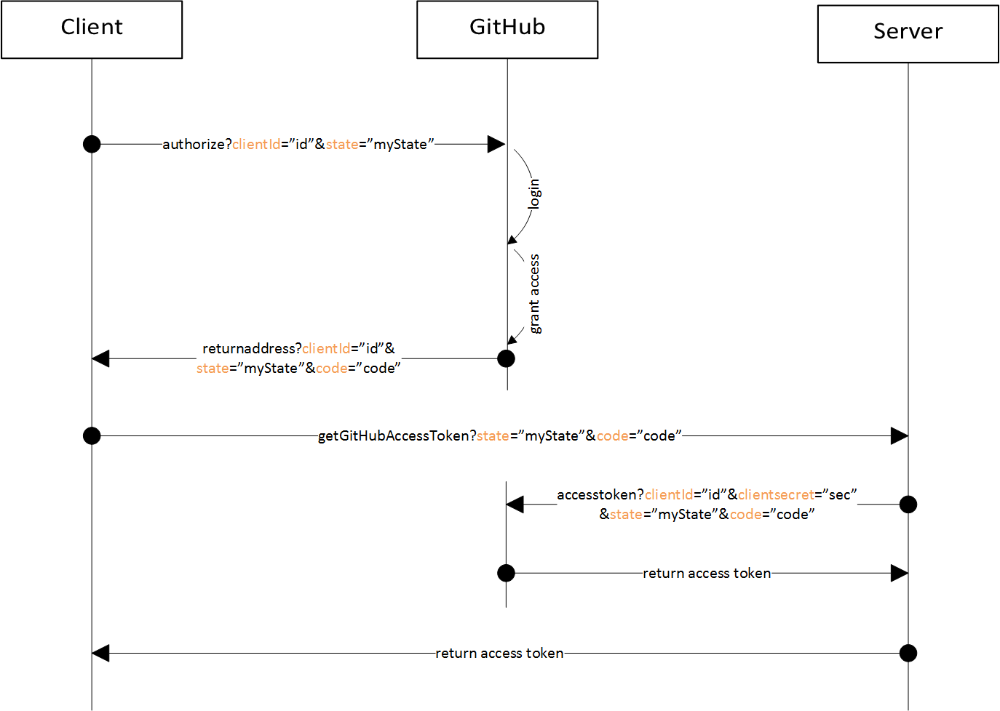

# OAuth with GitHub

**UserStory:**

In order to use (private) repositories instead of uploading all files into a Artifact Template, it is necessary to log in into GitHub.
  Therefore, the OAuth flow is implented as follows:
  
1. By clicking the `Login with GitHub` button, the browser gets redirected to GitHub for authentication.
    1. Login and authorize the Application to access the private repositories.
    1. Or, if the application was already been authorized, GitHub automatically continues with step 2
1. GitHub answers with the `status` and `code` parameters which are parsed and send to our server to get the access token.
1. Our server responses with the access token.

  

## Considered Alternatives
* *[ALTERNATIVE 1]* Perform the whole login process in the browser
* *[ALTERNATIVE 2]* Perform the whole login process in the backend
* *[ALTERNATIVE 3]* Mix both, frontend and backend to get the access token

## Decision Outcome
* *Chosen Alternative: [ALTERNATIVE 3]*
   because we can easily protect our client secret on the server, store the token safely in the clients local storage and 
   do not need to keep the state at the server. Further, it is possible to save additional user information in the local
   storage without the need for getting it every time from the server.

## Pros and Cons of the Alternatives

### [ALTERNATIVE 1]
* *+ good separation of concerns*
* *+ fast and direct communication between client and OAuth provider*
* *- the client secret must be stored in the javascript code* 

### [ALTERNATIVE 2]
* *+ the client secret can be stored safely*
* *- the server needs to maintain a state to remember the current state*

### [ALTERNATIVE 3]
* *+ pro arguments of both alternatives*
* *- more communication needed to perform the login*

## License

Copyright (c) 2017 Contributors to the Eclipse Foundation

See the NOTICE file(s) distributed with this work for additional
information regarding copyright ownership.

This program and the accompanying materials are made available under the
terms of the Eclipse Public License 2.0 which is available at
http://www.eclipse.org/legal/epl-2.0, or the Apache Software License 2.0
which is available at https://www.apache.org/licenses/LICENSE-2.0.

SPDX-License-Identifier: EPL-2.0 OR Apache-2.0
