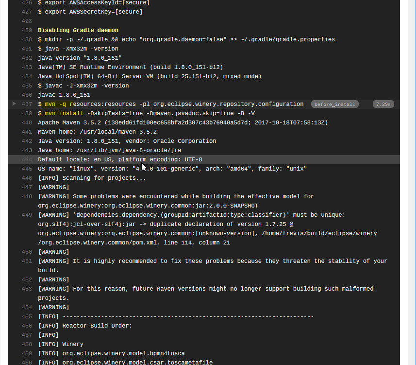

# Use CircleCI for Continuous Integration

* Status: Accepted
* Date: 2018-06-21

## Context and Problem Statement

Winery needs to be build using continuous integration.

## Decision Drivers

* Easy to configure CI solution
* For free CI solution
* Only important output should be logged

## Considered Options

* [TravisCI](https://docs.travis-ci.com/)
* [CircleCI](https://circleci.com/docs/2.0/)
* [Eclipse Common Build Infrastructure - Jenkins](https://wiki.eclipse.org/Jenkins)

## Decision Outcome

Chosen option: "CircleCI", because

- The build worklfow on Jenkins is hard to configure
- TravisCI  does not pass Maven's `-q` parameter everywhere and thus we have
  
- TravisCI sometimes throttles down builds (due to heavy load in the Eclipse organization)
- CircleCI offers to use a Docker image as basis and then executing arbitrary commands
- CircleCI offers to collect test results and presents them in aggregated form
- CircleCI offers to collect build artifacts and offers them to logged in users

## License

Copyright (c) 2018 Contributors to the Eclipse Foundation

See the NOTICE file(s) distributed with this work for additional
information regarding copyright ownership.

This program and the accompanying materials are made available under the
terms of the Eclipse Public License 2.0 which is available at
http://www.eclipse.org/legal/epl-2.0, or the Apache Software License 2.0
which is available at https://www.apache.org/licenses/LICENSE-2.0.

SPDX-License-Identifier: EPL-2.0 OR Apache-2.0
