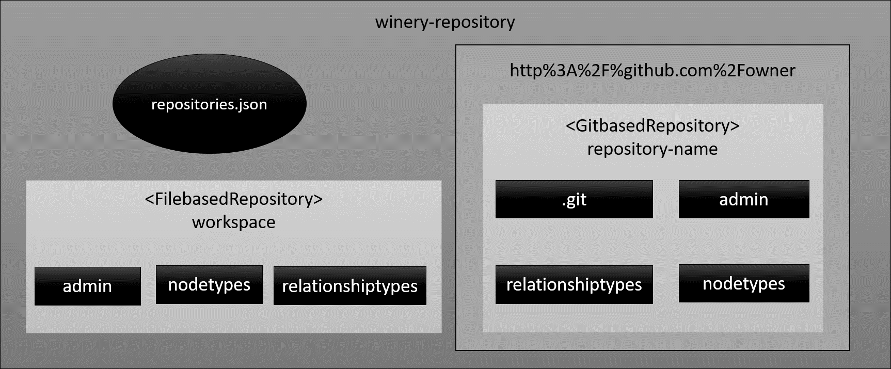

# Support of multiple repositories

* Status: pending
* Deciders: [Lukas Harzenetter](https://github.com/lharzenetter), [Sascha Zeller](https://github.com/zesaro)
* Date: 2019-04-18

Technical Story: [Pull Request 124](https://github.com/OpenTOSCA/winery/pull/124) <!-- optional -->

## Context and Problem Statement
To help developers obtain TOSCA elements in a more practical way, an approach to supporting multiple repositories distributed across different servers is presented here.
The result provides the ability to define a set of URLs and load them into the current winery-repository.

## Considered Options

* Merge the content of the repositories inside the winery-repository
* Use a similar approach like npm and declare each repository as a module

## Decision Outcome

Option 2 was chosen to manage each repository individually. This makes it possible to use existing version control systems in the individual repositories.

The repositories are structured as follows.

### Positive Consequences <!-- optional -->

* User can search for elements online and load a repository using the url
* It's enough to send a URL instead of a CSAR
* Manage each repository independently
* The origin and the version history of a repository can be checked
* The possibility to contribute directly to the development of a repository

### Negative consequences <!-- optional -->

* User is forced to define namespaces in Namespaces.json.
* Additional configuration file (repositories.json)


## Usage
1. Make sure the winery-repository is empty (or move existing files into a new folder called "workspace")
2. Create a repositories.json in the root directory of the repository
    1. Create a new object inside the json file
    2. For each repository you want to add
        1. Use the URL of the repository as a String element
        2. Use the Branch name as a value for the element (also as String)
        3. Separate each element with a comma
    3. Example:
        
     ```json
     {
        "https://github.com/OpenTOSCA/tosca-definitions-public" : "master",
        "https://github.com/winery/test-repository" : "master"
     }
     ```
 3. Start Server and UI


## License

Copyright (c) 2019 Contributors to the Eclipse Foundation

See the NOTICE file(s) distributed with this work for additional
information regarding copyright ownership.

This program and the accompanying materials are made available under the
terms of the Eclipse Public License 2.0 which is available at
http://www.eclipse.org/legal/epl-2.0, or the Apache Software License 2.0
which is available at https://www.apache.org/licenses/LICENSE-2.0.

SPDX-License-Identifier: EPL-2.0 OR Apache-2.0
