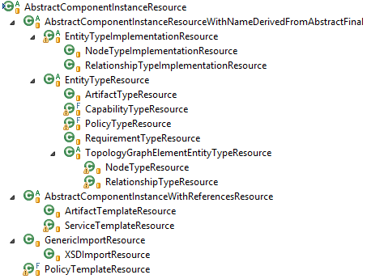

# REST

All resources are implemented in classes in the package `org.eclipse.winery.repository.rest.resources`.
We call all elements directly nested in the definitions element "components".
They are implemented using JAX RS 1.1 using [Jersey 1.x](https://jersey.github.io/documentation/1.19.1/index.html).

The full set the API is used by the Type, Template, and Artifact Management UI (see [User Documentation](../user/)).
A subset of the API is used at [IWineryRepository](#iwineryrepository).

## URL Structure

The idea behind the URL structure may shortly describes by `ROOT/<componenttype>s/<double-encoded-namespace>/<double-encoded-id>/<resource-specific-part>`, which makes the structure similar to one of the [file system](RepositoryLayout).
Encoding is done following [RFC 3986](https://tools.ietf.org/html/rfc3986#section-2.1). 
An online URL-encoder may be found at: <http://www.albinoresearch.com/misc/urlencode.php>.

For instance, the NodeType "NT1" in the namespace `http://www.example.com/NodeTypes` is found at the URL `nodetypes/http%253A%252F%252Fexample.com%252FNodeTypes/NT1/`.
As the browser decodes the URL, the namespace and the id are double encoded. 
Note the additional encoding of the symbol `%` in comparison to the encoding at the filesystem.
This is due to security decisions to disallow `%2F` in URLs.

The part until `<componenttype>s` is realized by ["AbstractComponentsResource" and its subclasses](#collections-of-components).
The resource specific part is realized by [subclasses of AbstractComponentInstanceResource](#component-instances).

More information on encoding is given at [Encoding](Encoding).

## Collections of Components

  
**Figure 6: Inheritance of AbstractComponentResource**

Figure 6 shows the inheritance of AbstractComponentsResource. It contains an intermediate class
"AbstractComponentsWithTypeReferenceResource" which handles a POST with an additional type. It is used at
all components which have a type associated. These are artifact templates, node type implementations,
relationship type implementations and policy templates.

All logic is implemented in AbstractComponentsRessource.
It handles creation of resources (using POST) and creation of AbstractComponentInstanceResources.

## Component Instances

  
**Figure 7: Inheritance of AbstractComponentInstanceResource**

Figure 7 shows the inheritance of AbstractComponentInstanceResource.
For each component, a class exists.
Using Intermediate classes, common properties are handled.
These are explained in the following sections.

### AbstractComponentInstanceResourceWithNameDerivedFromAbstractFinal

Several component instances have the attributes "name", "dervidedFrom", "abstract", and "final". These are
handled in the class "AbstractComponentInstanceResourceWithNameDerivedFromAbstractFinal". In this group,
type implementations, namely node type implementations and relationship type implementations can be found.

Furthermore, type resources exist. These are grouped by the "EntityTypeResource". Within the context of this class,
"TopologyGraphElementEntityTypeResource" is introduced. This class groups together "NodeTypeResource" and "RelationshipTypeResource".

### AbstractComponentInstanceWithReferencesResource

This class groups together classes with file references. Artifact Templates may reference files and a Service
Template may reference plans. The user can copy files manually to the right place in the directory structure of
the repository. By calling the method "synchronizeReferences()", the referenced stores in the XML are
synchronized with the actually existing files. This is done whenever the XML is retrieved from the repository.

#### GenericImportResource

This class is used to handle different import types. Currently only CSD is supported. The class is
"XSDImportResource".

#### PolicyTemplateResource

This class implements the resource for a policy template. Since a policy template does not contain any external
file references, it is not modeled as child of "AbstractComponentInstanceWithReferencesResource".

## License

Copyright (c) 2013-2018 Contributors to the Eclipse Foundation

See the NOTICE file(s) distributed with this work for additional
information regarding copyright ownership.

This program and the accompanying materials are made available under the
terms of the Eclipse Public License 2.0 which is available at
http://www.eclipse.org/legal/epl-2.0, or the Apache Software License 2.0
which is available at https://www.apache.org/licenses/LICENSE-2.0.

SPDX-License-Identifier: EPL-2.0 OR Apache-2.0
