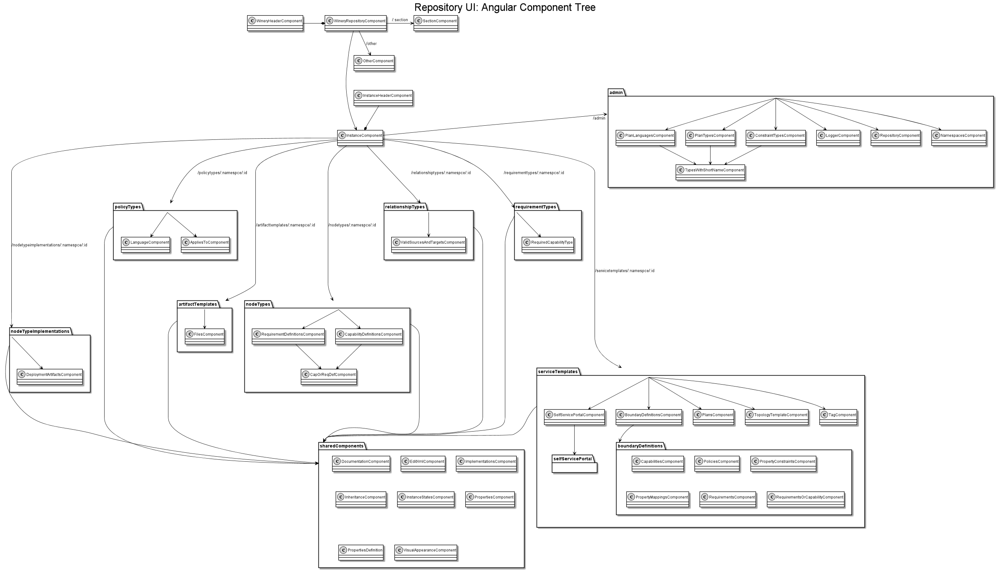

# Repository: Angular UI

In [Angular](angular.io), the project structure should be very flat. However, because we have a very complex and often nested
system, this structure is also present in the angular app.

## Structure

Entry into the angular app is the `WineryRepositoryComponent`. It contains the standard header and the router outlet.
All main routes are configured in the `WineryRepositoryRoutingModule` which is bootstrapped in the `WineryRepositoryModule`.

[source](repositoryUiAngularComponentDiagram.plantuml)

### Main Routes
The main routes are `other`, `notfound` and `:section`, whereas `:section` stands for all possible types that are specified
in TOSCA (e.g. Service Templates, Node Types, Relationship Types, etc.). Besides the components for the main routes, the
Winery specific modules can be found here. These are, for example, a generic uploader component `winery-uploader`
or the `winery-modal`.

### Section
The `SectionComponent` is responsible for displaying all instances available for the specific `:section`. It allows to add new
components and group them by namespace.

### Other
The `OtherComponent` only provides some links to reach all tosca components.

### Instance
The `InstanceComponent` is a container to display all TOSCA specific content, including the admin section, equally.
Similarly to the `WineryRepositoryComponent`, it provides the header for each component according to their definitions only.
All subcomponents are also rendered in the router outlet.

#### Admin
Components for the management of the repository are declared here. Internally, they are all depending on the same component
(`winery-instance-type-with-short-name`) which gets the backend-urls depending on the current route. 

#### ArtifactTemplates, ..., ServiceTemplates
Here, all components specific to one TOSCA component are declared.

#### Shared Components
All components which are used in more than one TOSCA component are declared here.

### Winery Modules
There are some modules which are used in almost every component, like the `WineryModalModule` or `WineryNotificationService`.
All of them can be found in the same level as the main routes. Besides those modules there are some additional utilities
like the `ExistService`, pipes or a validator.

## API Documentation
The API documentation is automatically generated by running the build process: `npm run build`. Afterwards, the documentation
can be found in `org.eclipse.winery.repository.ui/dist/doc/index.html`. It is also shown by using the shortcut <kbd>CTRL</kbd> + <kbd>Q</kbd>
(in IntelliJ) to see documented members/methods/classes.

## License

Copyright (c) 2017 University of Stuttgart.

All rights reserved. This program and the accompanying materials
are made available under the terms of the [Eclipse Public License v1.0]
and the [Apache License v2.0] which both accompany this distribution,
and are available at http://www.eclipse.org/legal/epl-v10.html
and http://www.apache.org/licenses/LICENSE-2.0

Contributors:
* Lukas Harzentter - initial API and implementation

 [Apache License v2.0]: http://www.apache.org/licenses/LICENSE-2.0.html
 [Eclipse Public License v1.0]: http://www.eclipse.org/legal/epl-v10.html
