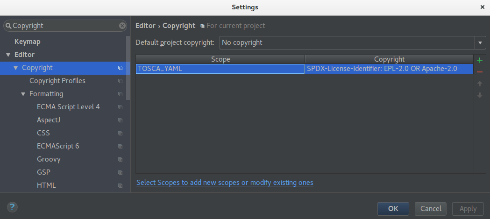
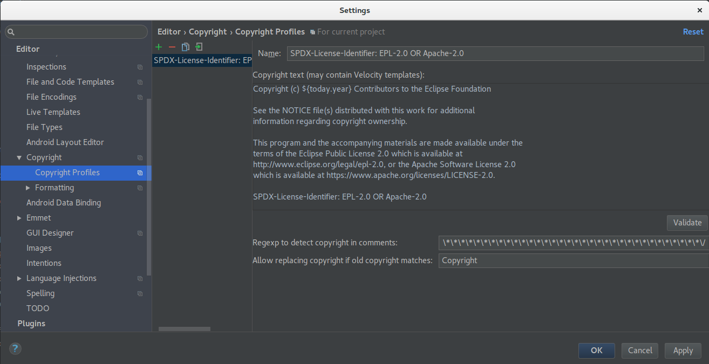

# Eclipse Winery Toolchain

<!-- toc -->

- [GitHub - Start](#github---start)
  * [Steps to get write access to the repositories](#steps-to-get-write-access-to-the-repositories)
  * [Steps to initialize the repository](#steps-to-initialize-the-repository)
  * [Steps for working on a topic](#steps-for-working-on-a-topic)
- [GitHub - Prepare Final Pull Request](#github---prepare-final-pull-request)
- [GitHub - Create Final Pull Request](#github---create-final-pull-request)
- [GitHub - Change Final Pull Request](#github---change-final-pull-request)
- [GitHub - After Pull Request Got Merged](#github---after-pull-request-got-merged)
- [Excursus: Git](#excursus-git)
- [Update copyright header](#update-copyright-header)
- [License](#license)

<!-- tocstop -->

This presents the tool chain used for creating and updating a pull request on GitHub.

For setup the IDE, please go to the [DevGuide](./).

## GitHub - Start

To contribute to Eclipse Winery development you need a GitHub account and access to <https://github.com/opentosca/winery>.
Email your supervisor your GitHub username.

- In case you did not choose an account name, use `flastname` as pattern:
  `f` is the lower-case first letter of your firstname and
  `lastname` is the lower-case lastname.
- Due to open source development, your email adress will get public.
  In case, you don't have a public email adress, we recommend to create one or use your student email adress.
  In case you want to create a longer-lasting one, please use the GitHub username.
  Example: `flastname@gmail.com`.

### Steps to get write access to the repositories

1. Email your supervisor your GitHub username and your development email address.
2. Your supervisor adds you to the team "developers" at <https://github.com/opentosca> and <https://github.com/winery>.
3. You will receive two emails from GitHub asking for your confirmation.
4. Open the link <https://github.com/orgs/winery/invitation>.
5. Open the link <https://github.com/orgs/OpenTOSCA/invitation>.

### Steps to initialize the repository

  1. Clone <https://github.com/opentosca/winery> (it automatically becomes the `origin`).
     - We recommend that git repositories reside in `c:\git-repositories`.
     - Use [ConEmu](https://conemu.github.io/) as program for all your shells: `choco install conemu`.
       Install [chocolatey](https://chocolatey.org/) to use the `choco` command.
     - Execute `git clone https://github.com/OpenTOSCA/winery.git` in `c:\git-repositories`.
  2. Change into the newly created directory `winery`: `cd winery`.
  3. Add `upstream` as second remote: `git remote add upstream https://github.com/eclipse/winery.git`
  4. Fetch everything from `upstream`: `git fetch upstream`

### Steps for working on a topic

  1. Create a new branch for each topic (fix a bug, add functionality) and name it accordingly.
  2. Sync with latest changes on origin (especially master branch): `git fetch origin`.
  3. Create branch based on `upstream/master` and make it known publicly:
     - `git checkout upstream/master`
     - `git checkout -b [name]`
     - `git push --set-upstream origin [name]`
  4. Do you your fist commit. Don't forget to sign the commit (<kbd>Ctrl</kbd>+<kbd>S</kbd> in Git Gui).
  6. Push the changes to origin: `git push`.
  7. Create [WIP] Pull Request.
     - Go to <https://github.com/opentosca/winery> 🡒 Pull Request
     - Fill in the title of the Pull Request following the patter `[WIP] Title of the thesis/work/target`

    - Fill in the provided description form

     - Add `[x]` to the items listed in the write field
     - Check the description in the Preview and send the Pull Request
  8. There are automatic checks in place

  9. If there is a red cross, click in repective "Details" and fix them

You keep working and discuss with your supervisor how things go:
    
  1. Commit. Don't forget to sign the commit (<kbd>Ctrl</kbd>+<kbd>S</kbd> in Git Gui).
  2. `git push`
  3. Keep your branch updated with `upstream/master`:
     - `git fetch upstream`
     - `git merge upstream/master`
     - Resolve conflicts - if there are some. See <https://www.jetbrains.com/help/idea/resolving-conflicts.html> for a documentation when using IntellIJ.
     - `git push`

## GitHub - Prepare Final Pull Request

The aim of these steps to have a **single commit**.
This is required by the Eclipse process for checking for intellectual property (IP process for short).

**Before commencing these steps, check with your supervisor**

* Check [CONTRIBUTING.md](https://github.com/eclipse/winery/blob/master/CONTRIBUTING.md) and carefully read the instructions
* <http://wiki.eclipse.org/Development_Resources/Contributing_via_Git> 🡒 Create an account **WITH THE SAME EMAIL THEN USED FOR THE COMMITS** (can also be checked in [gitk])
* Sign the Contributor Agreement electronically
* Steps to prepare Pull Request:
  1. `git fetch upstream` - fetches all updates from https://github.com/eclipse/winery ("upstream") to the local git storage
  2. `git merge upstream/master` - merges all updates from upstream to the local branch
  3. (Resolve merge conflicts) - required if there are conflicting changes
  4. Commit & Push with signed commit message (<kbd>Ctrl</kbd>+<kbd>S</kbd> in Git Gui) - this ensures that you have the changes backuped in case something goes wrong at the next steps 
  5. `git reset upstream/master` - this prepares that all commits can be squashed together:
     The local checkout ("working tree") is left untouched, but the "pointer" of the current branch is reset to `upstream/master`.
     Now, Git Gui shows the difference between `upstream/master` and your changes.
  6. Check changes in Git Gui:
     - Each change you wanted: Is it recognized?
     - At each file: Is the copyright information in the [header](CodeHeaders.md) OK?
     - Check if you are listed in the [NOTICE](https://github.com/eclipse/winery/blob/master/NOTICE) file as a contributor with the correct year
     - Are there too much changed lines? 🡒 Do not stage spurious lines to the commit (e.g., tab to spaces, ...)
     - Are there too much changed files? 🡒 Do not stage files you did not intend to change (e.g., `build.gradle` if you did not touch `build.gradle` at all)
     - Check again the style (!)
     - (Don't forget RESCAN to see the current changes)
  7. Add Changes/Fixed to `CHANGELOG.md` and add description to `docs/index.md` (if helpful)
  8. Press "Stage to Commit" 🡒 all changes are staged to Commit
  9. Sign the Commit Message (<kbd>Ctrl</kbd>+<kbd>S</kbd> in Git Gui)
  10. Commit & Push with "force overwrite" since you changed the branch: `git push -f`

## GitHub - Create Final Pull Request

**Attention: Commits on the same branch done after the Pull Request is sent are still part of the Pull Request (!)**

* Go to https://github.com/eclipse/winery 🡒 Pull Request
* Fill in the title of the Pull Request and give a more detailed description of the changes or added functionality
* In case of UI changes: Add screenshots
* Add `[x]` to the items listed in the write field
* Check the description in the Preview and send the Pull Request
* Close your Pull Request at OpenTOSCA/winery with a comment referencing the full URL of the new Pull Request, e.g. `Follow up at https://github.com/eclipse/winery/pull/212`.

## GitHub - Change Final Pull Request

* There are automatic checks in place

* If there is a red cross, click in repective "Details" and fix them

* In case of missing code quality, ... changes are requested by a committer (person controlling the pull request process)
* FOR WINERY THE FOLLOWING APPLIES:
  - Open Git Gui
  - Make requested changes in your code (don't forget to RESCAN)
  - Commit
  - Push
  - Wait for a second review
  - In case everything is fine, squash the commits into one.
    See [GitHub - Prepare Pull Request](#github---prepare-pull-request).
    Then, do a force push (`git push -f`).

## GitHub - After Pull Request Got Merged

* Delete the branch locally.
* The branch on origin (<https://github.com/OpenTOSCA/winery>) is deleted by the maintainer having done the merge.

## Excursus: Git

Please see also [use gitk to understand git](https://lostechies.com/joshuaflanagan/2010/09/03/use-gitk-to-understand-git/) to understand the settings in git.

## Update copyright header
Steps to update copyright headers:
1. Define scopes to apply the copy right header to:
    - Open properties `ctrl alt s` and search for `Scopes`
    - Select packages for the scope and click `Include Recursively`
    
2. Apply copyright settings to Scope:
    - Open properties `ctrl alt s` and search for `Copyright`
    - Add copyright entry and apply previously created scope
    
3. Create copyright profile:
    - Open Settings/Editor/Copyright/'Copyright Profiles'
    - Add copyright text without borders
        - Set Copyright year dynamically with `${today.year}` 
    - Add copyright regex (Acquired by selecting the copyright header in intellij editor and pressing `ctrl shift f`)
    - Allow replacing old copyright identified by regex seems not to work
    
4. Adjust copyright formatting settings
    - Open Settings/Editor/Copyright/Formatting
    - Change to `Use block comments` with `Prefix each line`, set `Relative Location` to `Before other comments`and increase `Separator before/after Length` to `81`
    
5. Delete previous copyright header manually (Replace with empty String)
6. Right click package and choose `Update Copyright..`
    - Check files for duplicated copyright header (occurs if copyright regex not set correctly)

## License

Copyright (c) 2017 University of Stuttgart.

All rights reserved. This program and the accompanying materials
are made available under the terms of the [Eclipse Public License v2.0]
and the [Apache License v2.0] which both accompany this distribution.

  [Apache License v2.0]: http://www.apache.org/licenses/LICENSE-2.0.html
  [Eclipse Public License v2.0]: http://www.eclipse.org/legal/epl-v20.html
  [gitk]: https://lostechies.com/joshuaflanagan/2010/09/03/use-gitk-to-understand-git/
