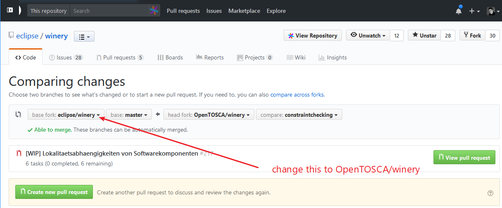

# Eclipse Winery Toolchain

<!-- toc -->

- [Steps for working on a topic](#steps-for-working-on-a-topic)
- [GitHub - Prepare Final Pull Request](#github---prepare-final-pull-request)
- [GitHub - Create Final Pull Request](#github---create-final-pull-request)
- [GitHub - Change Final Pull Request](#github---change-final-pull-request)
- [GitHub - After Pull Request Got Merged](#github---after-pull-request-got-merged)
- [Excursus: Git](#excursus-git)

<!-- tocstop -->

This presents the tool chain used for creating and updating a pull request on GitHub.

For the general setup, please go to [ToolChain-initialization](ToolChain-initialization.md).

## Steps for working on a topic

  1. Create a new branch for each topic (fix a bug, add functionality) and name it accordingly.
     - Thesis: `thesis/SHORT-THESIS-TITLE`. Replace `SHORT-THESIS-TITLE` with something meaningful
     - EnPro: prefix `fix`, `feature`, `wip` (see below) with `enpro/`
     - StuPro: prefix `fix`, `feature`, `wip` (see below) with `stupro/`
     - Bugfix: `fix/issue-NNN` or `fix/SHORT-TITLE` if fixing an issue with a number or give it a title
     - Feature: `feature/issue-NNN` or `feature/SHORT-TITLE`
     - WIP: `wip/SHORT-TITLE` for work in progress without issue and you know won't be finished soon
  2. Sync with latest changes on origin (especially master branch): `git fetch origin`.
  3. Create branch based on `upstream/master` and make it known publicly:
     - `git checkout upstream/master`
     - `git checkout -b [name]`
     - `git push --set-upstream origin [name]`
  4. Do you your fist commit. Don't forget to sign the commit (<kbd>Ctrl</kbd>+<kbd>S</kbd> in Git Gui).
  6. Push the changes to origin: `git push`.
  7. Create [WIP] Pull Request.
     - Go to <https://github.com/opentosca/winery> 🡒 Pull Request
     - Change the "base branch" to OpenTOSCA/winery
       
     - Fill in the title of the Pull Request following the pattern `[WIP] Title of the thesis/work/target`
     - Fill in the provided description form
     - Add `[x]` to the items listed in the write field
     - Check the description in the Preview and send the Pull Request
  8. There are automatic checks in place
     
  9. If there is a red cross, click in respective "Details" and fix them

**You keep working and discuss with your supervisor how things go.**

After each working day, do the following:
    
  1. Commit. Don't forget to sign the commit (<kbd>Ctrl</kbd>+<kbd>S</kbd> in Git Gui).
  2. `git push`
  3. Keep your branch updated with `upstream/master`:
     - `git fetch upstream`
     - `git merge upstream/master`
     - Resolve conflicts - if there are some. See <https://www.jetbrains.com/help/idea/resolving-conflicts.html> for a documentation when using IntellIJ.
     - `git push`

## GitHub - Prepare Final Pull Request

The aim of these steps to have a **single commit**.
This is required by the Eclipse process for checking for intellectual property (IP process for short).

**Before commencing these steps, check with your supervisor**

### Formal Requirements

* <http://wiki.eclipse.org/Development_Resources/Contributing_via_Git> 🡒 Create an account **WITH THE SAME EMAIL AS USED FOR THE COMMITS** (can also be checked in [gitk])
* Sign the Contributor Agreement electronically

### Git Steps: Ensure that a single commit is created

  1. `git fetch upstream` - fetches all updates from https://github.com/eclipse/winery ("upstream") to the local git storage
  2. `git merge upstream/master` - merges all updates from upstream to the local branch
  3. (Resolve merge conflicts) - required if there are conflicting changes
  4. Commit & Push with signed commit message (<kbd>Ctrl</kbd>+<kbd>S</kbd> in Git Gui) - this ensures that you have the changes backuped in case something goes wrong at the next steps 
  5. `git reset upstream/master` - this prepares that all commits can be squashed together:
     The local checkout ("working tree") is left untouched, but the "pointer" of the current branch is reset to `upstream/master`.
     Now, Git Gui shows the difference between `upstream/master` and your changes.
  6. Check changes in Git Gui:
     - Each change you wanted: Is it recognized?
     - At each file: Is the copyright information in the [header](CodeHeaders.md) OK?
     - Check if you are listed in the [NOTICE](https://github.com/eclipse/winery/blob/master/NOTICE) file as a contributor with the correct year
     - Are there too much changed lines? 🡒 Do not stage spurious lines to the commit (e.g., tab to spaces, ...)
     - Are there too much changed files? 🡒 Do not stage files you did not intend to change (e.g., `build.gradle` if you did not touch `build.gradle` at all)
     - Check again the style (!)
     - (Don't forget RESCAN to see the current changes)
  7. Add Changes/Fixed to `CHANGELOG.md` and add description to `docs/index.md` (if helpful)
  8. Press "Stage to Commit" 🡒 all changes are staged to Commit
  9. Sign the Commit Message (<kbd>Ctrl</kbd>+<kbd>S</kbd> in Git Gui)
  10. Commit & Push with "force overwrite" since you changed the branch: `git push -f`

## GitHub - Create Final Pull Request

**Attention: Commits on the same branch done after the Pull Request is sent are still part of the Pull Request (!)**

* Go to https://github.com/eclipse/winery 🡒 Pull Request
* Fill in the title of the Pull Request and give a more detailed description of the changes or added functionality
* In case of UI changes: Add screenshots
* Add `[x]` to the items listed in the write field
* Check the description in the Preview and send the Pull Request
* Close your Pull Request at OpenTOSCA/winery with a comment referencing the full URL of the new Pull Request, e.g. `Follow up at https://github.com/eclipse/winery/pull/212`.

## GitHub - Change Final Pull Request

* There are automatic checks in place

* If there is a red cross, click in repective "Details" and fix them

* In case of missing code quality, ... changes are requested by a committer (person controlling the pull request process)
* FOR WINERY THE FOLLOWING APPLIES:
  - Open Git Gui
  - Make requested changes in your code (don't forget to RESCAN)
  - Commit
  - Push
  - Wait for a second review
  - In case everything is fine, squash the commits into one.
    See [GitHub - Prepare Pull Request](#github---prepare-pull-request).
    Then, do a force push (`git push -f`).

## GitHub - After Pull Request Got Merged

* Delete the branch locally.
* The branch on origin (<https://github.com/OpenTOSCA/winery>) is deleted by the maintainer having done the merge.

## Excursus: Git

Please see also [use gitk to understand git](https://lostechies.com/joshuaflanagan/2010/09/03/use-gitk-to-understand-git/) to understand the settings in git.

## License

Copyright (c) 2017 Contributors to the Eclipse Foundation

See the NOTICE file(s) distributed with this work for additional
information regarding copyright ownership.

This program and the accompanying materials are made available under the
terms of the Eclipse Public License 2.0 which is available at
http://www.eclipse.org/legal/epl-2.0, or the Apache Software License 2.0
which is available at https://www.apache.org/licenses/LICENSE-2.0.

SPDX-License-Identifier: EPL-2.0 OR Apache-2.0

  [gitk]: https://lostechies.com/joshuaflanagan/2010/09/03/use-gitk-to-understand-git/
