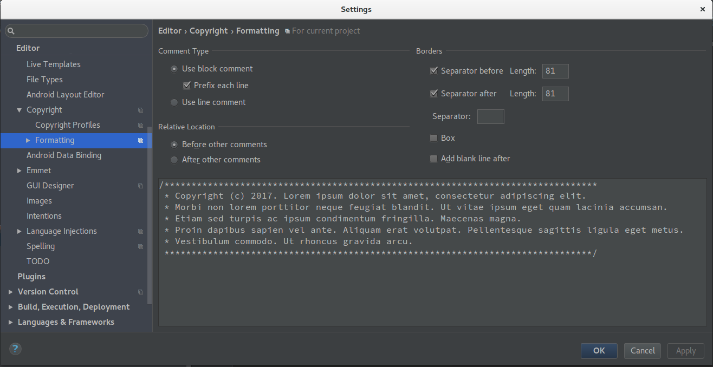
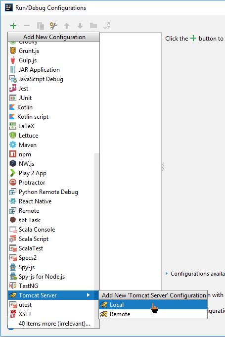
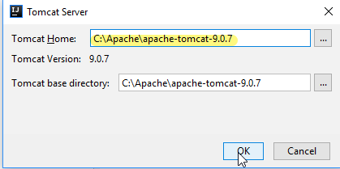
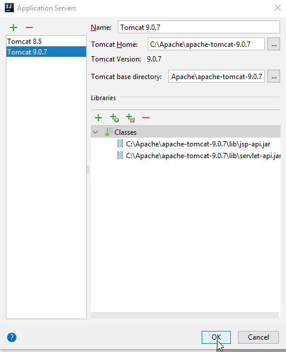
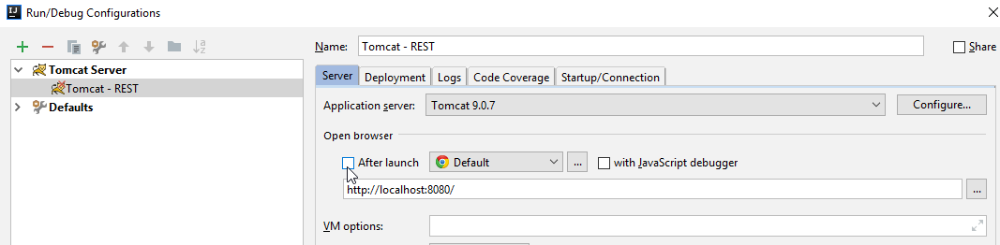
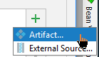
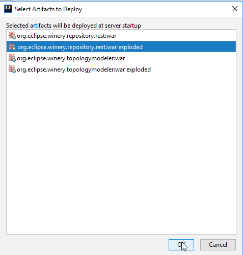
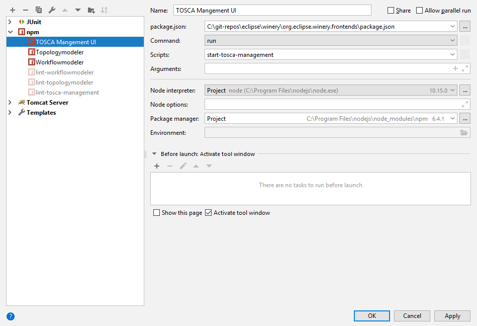
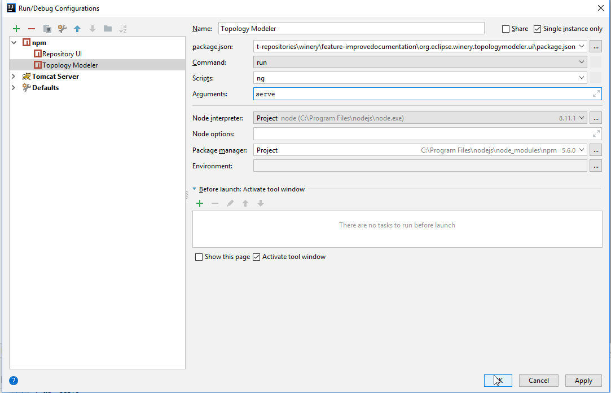

# IntelliJ Configuration

Preparation: Generate a war to have all dependencies fetched by maven: `mvn package`

1. Install JRebel plugin
    - JRebel enables a better debugging - changes can be immediately loaded without building the whole project again
    - Download https://zeroturnaround.com/software/jrebel/
    - Get a JRebel license from <https://my.rebel.com>.
      It is for free if JRebel may post to your Twitter account.
    - File --> Settings --> Plugins --> Search for JRebel
    - If JRebel is not available press "Browse repositories" --> Search -->Install
2. Open `pom.xml` in the main directory
3. Enable checkstyle: Follow the shown steps and apply them in IntelliJ
  
  - Install the [IntelliJ Checkstyle Plugin](https://plugins.jetbrains.com/plugin/1065-checkstyle-idea).
    It can be found via plug-in repository (Settings -> Plugins -> Browse repositories)
  - Open the Settings (by pressing <kbd>Ctrl</kbd> + <kbd>Alt</kbd> + <kbd>S</kbd>)
  - Go to Other Settings -> CheckStyle.
  - Click on the green plus and add `checkstyle.xml` from the root of the Winery code repository.
4. Configure the code style (Source: <https://youtrack.jetbrains.com/issue/IDEA-61520#comment=27-1292600>)
    1. Open the Settings (by pressing <kbd>Ctrl</kbd> + <kbd>Alt</kbd> + <kbd>S</kbd>)
    3. Go to "Editor > Code Style"
    3. Click "Manage..." (right of "Scheme:")
    4. Click "Import Scheme"
    4. Choose "IntelliJ IDEA code style XML"
    5. Navigate to  `intellij-idea-code-style.xml`. It is located in `docs/dev/config/IntelliJ IDEA`
    6. Press "OK"
    6. You will see a message "Winery configuration settings were imported".
    7. Press "OK"
    8. Press "Close"
    9. Press "OK"
5. Setup code headers to be inserted automatically
    1. Open the Settings (by pressing <kbd>Ctrl</kbd> + <kbd>Alt</kbd> + <kbd>S</kbd>)
    2. Go to Editor > Copyright  > Copyright Profiles
    3. Click the green plus
    4. Name "Winery"
    5. Copyright text from [CodeHeaders](../../CodeHeaders.md)
    6. Go to Editor > Copyright > Formatting
    7. Adjust copyright formatting settings
       - Change to `Use block comments` with `Prefix each line`
       - Set `Relative Location` to `Before other comments`
       - Increase `Separator before/after Length` to `81`
       - 
    8. Press "OK"
6. Setup Apache Tomcat
    1. Download Tomcat 9.0 from <https://tomcat.apache.org/download-90.cgi>.
       Choose "zip" (E.g., <http://mirror.synyx.de/apache/tomcat/tomcat-9/v9.0.7/bin/apache-tomcat-9.0.7.zip>).
    1. Extract it to `C:\Apache`. Result: `C:\Apache\apache-tomcat-9.0.7`.
    1. 
    1. 
    1. 
    1. 
    1. 
    1. 
    1. Press OK  
       
    1. Set name and no browser launch: 
       
    1. Add deployment artifacts: 
       
    1. 
    1. 
    1. Set `/winery` as application context: 
       
    1. Click "Apply"
6. Setup npm run for Repository UI
    1. 
    1. 
6. Setup npm run for Topology modeler
    1. 
    1. 
6. Optional: In case you do not want to have the live-update of Angular, you build the wars of the UI and then deploy as follows:
    - External artifact `.../org.eclipse.winery.repository.ui/target/winery-ui.war` to `/`
    - External artifact `.../org.eclipse.winery.workflowmodeler/target/winery-workflowmodeler.war` to `/winery-workflowmodeler`
7. Get a JetBrains account and vote up following issues (at the right side, just click the thumbs-up next to "Voters". In case you don't see "Voters", reload the page):
  - <https://youtrack.jetbrains.com/issue/IDEA-147601>
  - <https://youtrack.jetbrains.com/issue/IDEA-142591>
  - <https://youtrack.jetbrains.com/issue/IDEA-176611>
  - <https://youtrack.jetbrains.com/issue/IDEA-75437>
  - <https://youtrack.jetbrains.com/issue/IDEA-159739>
  - <https://youtrack.jetbrains.com/issue/IDEA-131223>
8. Pros: Install the [Key Promoter X plugin](https://plugins.jetbrains.com/plugin/9792-key-promoter-x).
9. Run everything
  - Select "Winery - REST". Click on "Play" (the green rectangle)
  - Select "Repository UI". Click on "Play"
  - Select "Topolgoy Modeler". Click on "Play".
  - Open "http://localhost:4200" in your browser.

## Further Remarks

* Please let `.editorconfig` override the settings of IntelliJ
* Shortcuts
  - 2x <kbd>Shift</kbd> / <kbd>Ctrl</kbd>+<kbd>Shift</kbd>+<kbd>F</kbd> / <kbd>Ctrl</kbd>+<kbd>F</kbd>: Differrent forms of search
  - <kbd>Ctrl</kbd>+<kbd>Alt</kbd>+<kbd>L</kbd>: Organize imports (fixes checkstyle)
  - <kbd>Ctrl</kbd>+<kbd>X</kbd>: if nothing is marked: cut line (equal to marking whole line and using <kbd>Ctrl</kbd>+<kbd>X</kbd>)
  - <kbd>Ctrl</kbd>+<kbd>Shift</kbd>+<kbd>T</kbd>: Create/jump to the test class
* See [UpdateCopyrightHeaders](UpdateCopyrightHeaders.md) for updating old copyright headers

## License

Copyright (c) 2017-2018 Contributors to the Eclipse Foundation

See the NOTICE file(s) distributed with this work for additional
information regarding copyright ownership.

This program and the accompanying materials are made available under the
terms of the Eclipse Public License 2.0 which is available at
http://www.eclipse.org/legal/epl-2.0, or the Apache Software License 2.0
which is available at https://www.apache.org/licenses/LICENSE-2.0.

SPDX-License-Identifier: EPL-2.0 OR Apache-2.0
