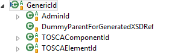

# Winery's Id System

The general idea behind the storage of Winery is that each entity comes with an id.
The id is either self contained or references a parent id, where the element is nested in.
All Ids inherit from `GenericId`.

  

The child `AdminId` is used for all administrative elements required for internal management.
`DummyParentForGeneratedXSDRef` is required during the export of generated XML Schema Definitions due to the use of Winery's key/value properties.
`DefinitionsChildId` is the parent element for all TOSCA Elements which may be defined directly as child of a "Definitions" element.
All other elements have "TOSCAElementId" as parent.

## AdminId

  
**Inheritance hierarchy of AdminId**

`NamespacesId` is used as container for a mapping file from namespace prefixes to namespaces. 
`TypesId` is the parent element of all types user can set.
These are not node types etc., but `ConstraintTypes` (for Constraints), `PlanLanguages` (for plans), and `PlanTypes` (for plans).
The inclusion of `PlanLanguages` is due to reuse of the class `AbstractTypesManager` for plan languages.
TOSCA does not restrict these enumerations.
Therefore, Winery manages all known types for itself.

## DefinitionsChildId

This Id class is used for all entities directly nested in a `TDefinitions` element.
They all have a namespace and an id attribute.
This is ensured by `DefinitionsChildId`.

  
*Inheritance hierarchy of DefinitionsChildId**

`EntityTemplateId` collects all Entity Templates directly nested in a Definitions element.
As a result, the ids of NodeTemplates or RelationshipTemplates do not inherit from EntityTemplateId.
They are contained in a Service Template and not directly in the Definitions element.
Thus, the only children of `EntityTemplateId` are `ArtifactTemplateId`, `PolicyTemplateId`, and `ServiceTemplateId`.

`EntityTypeId` collects all Entity Types directly nested in a `TDefinitions` element.
These are IDs for ArtifactTypes, CapabilityTypes, PolicyTypes, RequirementTypes, NodeTypes and RelationshipTypes.
Node Types and Relationship Types have the direct parent `TopologyGraphElementTypeId` as these two types form the types of components of the topology graph.

`EntityTypeImplementationId` is the parent id for NodeTypeImplementationId and RelationshipTypeImplementationId and thus subsumes the two possible entities which can be implementations.

`GenericImportId` is an artificial entity.
It is used to be able to store imports of an imported CSAR.
These imports might be XSD definitions, but also WSDL files.

## License

Copyright (c) 2013-2018 Contributors to the Eclipse Foundation

See the NOTICE file(s) distributed with this work for additional
information regarding copyright ownership.

This program and the accompanying materials are made available under the
terms of the Eclipse Public License 2.0 which is available at
http://www.eclipse.org/legal/epl-2.0, or the Apache Software License 2.0
which is available at https://www.apache.org/licenses/LICENSE-2.0.

SPDX-License-Identifier: EPL-2.0 OR Apache-2.0
