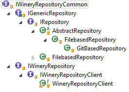
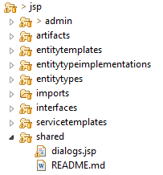
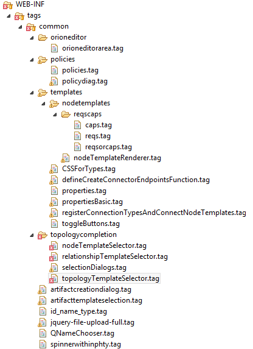
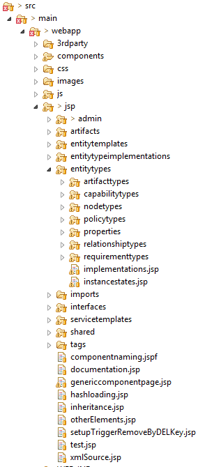
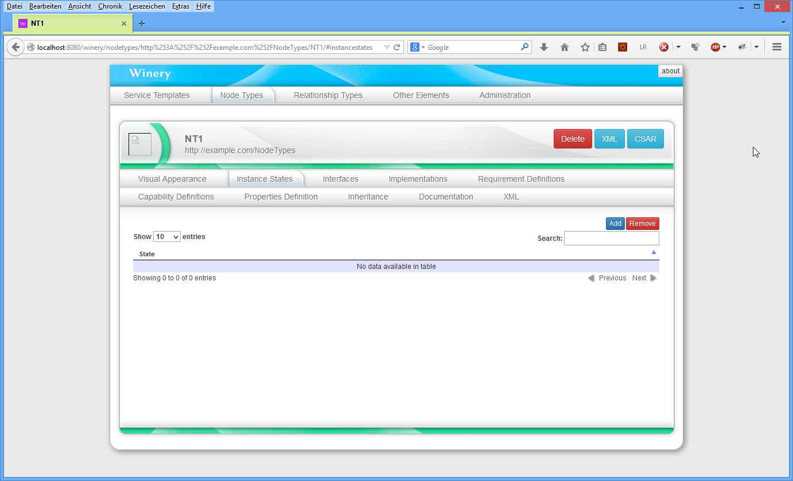

# Eclipse Winery™ Developer Guide

This document provides (i) guides about development and (ii) design ideas of Winery.

Other sources of information:

- [ToolChain](ToolChain) - GitHub workflow
- [CodeHeaders](CodeHeaders) - documentation about required code headers
- [RepositoryLayout](RepositoryLayout) - documents the layout of the repository (stored as plain text files)
- [TOSCA](../tosca/) - notes on OASIS TOSCA

Table of contents:

<!-- toc -->

- [Development Setup](#development-setup)
  * [IntelliJ Ultimate setup](#intellij-ultimate-setup)
  * [Eclipse setup](#eclipse-setup)
- [Development Information](#development-information)
  * [Making the wars](#making-the-wars)
  * [Branches](#branches)
- [Projects](#projects)
  * [Project org.eclipse.winery.common](#project-orgeclipsewinerycommon)
  * [Project org.eclipse.winery.highlevelrestapi](#project-orgeclipsewineryhighlevelrestapi)
  * [Project org.eclipse.winery.generators.ia](#project-orgeclipsewinerygeneratorsia)
  * [Project org.eclipse.winery.model.csar.toscametafile](#project-orgeclipsewinerymodelcsartoscametafile)
  * [Project org.eclipse.winery.model.selfservice](#project-orgeclipsewinerymodelselfservice)
  * [Project org.eclipse.winery.model.tosca](#project-orgeclipsewinerymodeltosca)
  * [Project org.eclipse.winery.repository.client](#project-orgeclipsewineryrepositoryclient)
  * [Project org.eclipse.winery.repository](#project-orgeclipsewineryrepository)
  * [Project org.eclipse.winery.topologymodeler](#project-orgeclipsewinerytopologymodeler)
- [TOSCA Definitions in Winery](#tosca-definitions-in-winery)
- [Uniqueness of QNames](#uniqueness-of-qnames)
- [Winery's Id System](#winerys-id-system)
  * [AdminId](#adminid)
  * [TOSCAComponentId](#toscacomponentid)
  * [Filesystem Layout](#filesystem-layout)
  * [REST Resources](#rest-resources)
  * [URL Schema](#url-schema)
  * [Collections of Components](#collections-of-components)
  * [Component Instances](#component-instances)
  * [AbstractComponentInstanceResourceWithNameDerivedFromAbstractFinal](#abstractcomponentinstanceresourcewithnamederivedfromabstractfinal)
  * [AbstractComponentInstanceWithReferencesResource](#abstractcomponentinstancewithreferencesresource)
    + [GenericImportResource](#genericimportresource)
    + [PolicyTemplateResource](#policytemplateresource)
- [Working with the Repository](#working-with-the-repository)
  * [IWineryRepositoryCommon](#iwineryrepositorycommon)
  * [IGenericRepository](#igenericrepository)
  * [IRepository](#irepository)
  * [IWineryRepository](#iwineryrepository)
- [Shared JSPs and TAGs](#shared-jsps-and-tags)
- [Type, Template, and Artifact Management](#type-template-and-artifact-management)
- [Topology Modeler](#topology-modeler)
- [Debugging Hints](#debugging-hints)
  * [Debugging JavaScript Code](#debugging-javascript-code)
    + [Chrome](#chrome)
    + [Firefox](#firefox)
  * [Automatic Browser Refresh](#automatic-browser-refresh)
  * [Faster Redeployment](#faster-redeployment)
- [Miscellaneous Hints](#miscellaneous-hints)
  * [Generating the Right Output](#generating-the-right-output)
  * [Other Troubleshootings](#other-troubleshootings)
  * ["name" vs. "id" at Entities](#name-vs-id-at-entities)
  * [Possible Attachments of Artifacts](#possible-attachments-of-artifacts)
- [Example Repository](#example-repository)
- [Abbreviations](#abbreviations)
- [References](#references)
- [License](#license)

<!-- tocstop -->

## Development Setup

Please enable the git-hooks by executing `git config core.hooksPath .git-hooks` in the root of the repository.

### IntelliJ Ultimate setup

See [config/IntelliJ IDEA/README.md](config/IntelliJ IDEA/README.md).

### Eclipse setup

See [config/Eclipse/README.md](config/Eclipse/README.md).

## Development Information

Winery uses [Apache Maven] for Java depedency management.
[bower] is used for fetching JavaScript dependencies.
Bower is installed automatically using the [frontend-maven-plugin].
We recommend installing JDK8 by using `choco install jdk8` to be able to update it via `choco upgrade all`. See at the homepage of [chocolatey] for more information.
Please follow the the next step "Making the wars" before importing the project into an IDE.

### Making the wars

Run `mvn package`.
In case [bower] fails, try to investigate using `mvn package -X`.
You can start bower manually in `org.eclipse.winery.repository` and `org.eclipse.winery.topologymodeler` by issuing `bower install`.

There are two WARs generated:

* `org.eclipse.winery.repository/target/winery.war` and
* `org.eclipse.winery.topologymodeler/target/winery-topologymodeler.war`

They can be deployed on a Apache Tomcat runtime environment.

### Branches

The `master` branch is always compiling and all tests should go through.
It contains the most recent improvements.
All other branches are real development branches and might event not compile.

There are no explicit branches for stable versions as winery is currently in development-only mode.

## Projects

This section provides a short overview on all projects Winery consists of.

### Project org.eclipse.winery.common

This project contains classes used by the repository and topology modeler projects. It contains constants, the id
system, interface definitions for repository access and the datatype to manage Winery's extended key/value properties.

### Project org.eclipse.winery.highlevelrestapi

This project contains an API to communicate with REST services. It provides an abstraction layer above Apache
Commons HTTPClient. It is used by projects generated by the IA generator to upload compiled 
implementations as implementation artifacts.

### Project org.eclipse.winery.generators.ia

This project contains the generator which generates a NodeType implementation based on a NodeType
interface.

### Project org.eclipse.winery.model.csar.toscametafile

This project contains the model for the file "Tosca.meta".

### Project org.eclipse.winery.model.selfservice

This project contains the model for the self service portal.  
It is used by the Vinothek [BBKL14] to display user defined data.

### Project org.eclipse.winery.model.tosca

This project contains a JAX B generated model of the XSD of OASIS TOSCA v1.0. The XSD hat to be modified to
enable proper referencing and use. An Implementation Artifactmay carry a "name" attribute. The contents of
properties of Boundary Definitions are processed in "lax" mode.

### Project org.eclipse.winery.repository.client

Whis project hosts a client using the REST API of the repository and offering a Java object based client to the
Winery repository.

### Project org.eclipse.winery.repository

This is the heart of Winery. This project hosts the repository, where all entities of TOSCA are stored and
managed. It realizes the components "Type, Template, and Artifact Management" and "Repository" (Figure 1).

### Project org.eclipse.winery.topologymodeler

This part of Winery enables modeling topologies graphically. It realizes the component "Topology Modeler"
(Figure 1).

## TOSCA Definitions in Winery

Definitions are not modeled as explicit element. Only the nested elements are handled by Winery.
That means, it is not possible to specify custom definitions bundling a customized subset of available elements.

## Uniqueness of QNames

Intentionally, a QName should be unique within the repository.
We did not follow this assumption, but only require that QNames are unique within a type.
That means, the repository allows `{http://www.example.org}id` for both a service template and a node type.
We introduced TOSCAcomponentId uniquely identifying a TOSCA element.
Future versions might redesign the backend to use a QName as the unique key.

## Winery's Id System

The general idea behind the storage of Winery is that each entity comes with an id. The id is either self
contained or references a parent id, where the element is nested in. All Ids inherit from GenericId.  
Figure 2 shows the inheritance hierarchy of GenericId. The child "AdminId" is used for all administrative elements
required for internal management. "DummyParentForGeneratedXSDRef" is required during the export of 
generated XML Schema Definitions due to the use of Winery's key/value properties. "TOSCAComponentId" is
the parent element for all TOSCA Elements which may be defined directly as child of a "Definitions" element.
All other elements have "TOSCAElementId" as parent.

  
**Figure 2: Inheritance hierarchy of GenericId**

### AdminId

Figure 3 shows the inheritance hierarchy of AdminId. "NamespacesId" is used as container for a mapping file
from namespace prefixes to namespaces. "TypesId" is the parent element of all types user can set. This are 
not node types etc., but ConstraintTypes (for Constraints), PlanLanguages (for plans), and PlanTypes (for plans).
The inclusion of "PlanLanguages" is due to reuse of the class AbstractTypesManager for plan languages. TOSCA
does not restrict these enumerations. Therefore, Winery manages all known types for itself.

  
**Figure 3: Inheritance hierarchy of AdminId**

### TOSCAComponentId

This Id class is used for all entities directly nested in a TDefinitions element. They all have a namespace and an
id attribute. This is ensured by ToscaComponentId. Figure 4 shows the inheritance hierarchy for TOSCAComponentId.


  
**Figure 4: inheritance hierarchy of ToscaComponentId**


"EntityTemplateId" collects all Entity Templates directly nested in a Definitions element. As a result, the ids of
NodeTemplates or RelationshipTemplates do not inherit from EntityTemplateId. They are contained in a Service Template
and not directly in the Definitions element. Thus, the only children of EntityTemplateId are ArtifactTemplateId,
PolicyTemplateId, and ServiceTemplateId.

"EntityTypeId" collects all Entity Types directly nested in a TDefinitions element.These are IDs for ArtifactTypes,
CapabilityTypes, PolicyTypes, RequirementTypes, NodeTypes and RelationshipTypes. Node Types and RelationshipTypes
have the direct parent "TopologyGraphElementTypeId" as these two Types form the types of components of the topology graph.

"EntityTypeImplementationId" is the parent id for NodeTypeImplementationId and RelationshipTypeImplementationId and thus
subsumes the two possible entities which can be implementations.

"GenericImportId" is an artificial entity. It is used to be able to store imports of an imported CSAR. These
imports might be XSD definitions, vut als WSDL files.

### Filesystem Layout

See [RepositoryLayout](RepositoryLayout).

### REST Resources

All resources are implemented in classes in the package org.eclipse.winery.repository.resources. We call all
elements directly nested in the definitions element "components". They are implemented using JAX RS 1.1 
using Jersey 1.17

The full set the API is used by the Type, Template, and Artifact Management UI (see Section 10). A subset of the
API is used at IWineryRepository (see Section 8.4).

### URL Schema

The idea behind the URL schema may shortly describes by ROOT/<componenttype>s/<double-encoded-namespace>/<double-encoded-id>/<resource-specific-part>,
which makes the structure similar to the file system (cf. Section 6). Encoding is done following RFC 3986. An online
URL-encoder may be found at: http://www.albinoresearch.com/misc/urlencode.php .

For instance, the NodeType "NT1" in the namespace "http://www.example.com/NodeTypes" is found behind the URL "nodetypes/http%253A%252F%252Fexample.com%252FNodeTypes/NT1/".
As the browser decodes the URL, the namespace and the id are double encoded. note the additional encoding of the symbol "%" in
comparison to the encoding at the filesystem (see Section 6).

The part until "<componenttype>s"is realized by "AbstractComponentsResource" and its subclasses (see Section 7.2).
The resource specific part is realized by subclasses of AbstractComponentInstanceResource (see Section 7.3).

### Collections of Components


  
**Figure 6: Inheritance of AbstractComponentResource**


Figure 6 shows the inheritance of AbstractComponentsResource. It contains an intermediate class
"AbstractComponentsWithTypeReferenceResource" which handles a POST with an additional type. It is used at
all components which have a type associated. These are artifact templates, node type implementations,
relationship type implementations and policy templates.

All logic is implemented in AbstractComponentsRessource. it handles creation of resources (using POST) and
creation of AbstractComponentInstanceResources.

### Component Instances


  
**Figure 7: Inheritance of AbstractComponentInstanceResource**


Figure 7 shows the inheritance of AbstractComponentInstanceResource. For each component, a class exists.
Using Intermediate classes, common properties are handled. These are explained in the following sections.

### AbstractComponentInstanceResourceWithNameDerivedFromAbstractFinal

Several component instances have the attributes "name", "dervidedFrom", "abstract", and "final". These are
handled in the class "AbstractComponentInstanceResourceWithNameDerivedFromAbstractFinal". In this group,
type implementations, namely node type implementations and relationship type implementations can be found.

Furthermore, type resources exist. These are grouped by the "EntityTypeResource". Within the context of this class,
"TopologyGraphElementEntityTypeResource" is introduced. This class groups together "NodeTypeResource" and "RelationshipTypeResource".

### AbstractComponentInstanceWithReferencesResource

This class groups together classes with file references. Artifact Templates may reference files and a Service
Template may reference plans. The user can copy files manually to the right place in the directory structure of
the repository. By calling the method "synchronizeReferences()", the referenced stores in the XML are
synchronized with the actually existing files. This is done whenever the XML is retrieved from the repository.

#### GenericImportResource

This class is used to handle different import types. Currently only CSD is supported. The class is
"XSDImportResource".

#### PolicyTemplateResource

This class implements the resource for a policy template. Since a policy template does not contain any external
file references, it is not modeled as child of "AbstractComponentInstanceWithReferencesResource".

## Working with the Repository

Figure 8 shows all interfaces related to interactions with the repository. The general idea is to seperate the
repository and the repository client. The repository itself is only accessed through the REST resources offered
by org.eclipse.winery.repository. The repository client uses these REST resources to access content of the repository.


  
**Figure 8: Inheritance of interfaces related to the repository**

### IWineryRepositoryCommon

IWineryRepositoryCommon collects all methods available both to the REST resources and the client. Currently,
only "forceDelete(GenericId)" is offered.

### IGenericRepository

IGenericRepository offers methods to access the content of the repository through the ids described in
Section 5. The idea is that the id points to a directory containing multiple files associated to the id.
Typically, a file with the extension "Definitions" is loaded. in the case of a NodeType, the file is called "NoteType.tosca".
To access that file, an instance of the class "RepositoryFileReference" is required. It is constructed by
"RepositoryFileReference(GenericId parent, String fileName)". The REST resources use then
"InputStream new InputStream(RepositoryFileReference ref) throws IOException" to access the content of a stored file.

Example:

```java

NodeTypeId id = new NodeTypeId("http://www.example.com/NodeTypes", "NT1", false);
RepositoryFileReference ref = new RepositoryFileReference(id, "NodeType.tosca");
try (InputStream is = Repository.Instance.newInputStream (ref)){
  // do something
}

```

In the real code, determining the reference for an Id is encapsulated in BackendUtils in the method
"getRefOfDefinitions".

### IRepository

IRepository additionally includes methods for working with configuration files. They are currently used in the
Admin part of Winery, where, for instance, namespaces are managed.

The implementation of IRepository is done in the classes Abstract Repository, FilebasedRepository, and 
GitBasedRepository. Both the FilebasedRepository and the GitBasedRepository work on the filesystem. The
GitBasedRepository additionally allows to set the revision to a given revision or to clean and reset the
repository.

Future extensions will allow a JClouds based file storage.

### IWineryRepository

This interface offers methods to get Java objects from a remote repository. For instance, the method
"<T extends TEntityType> T getType(QName qname, Class<T> type)" may be used to retrieve an EntityType
object out of a QName.

"IWineryRepositoryClient" offers methods to add repository URLs.

"WineryRepositoryClient" is a real client to the repository. It implements "IWineryRepositoryClient" using the
Jersey 1.1. web client. it uses a subset of the REST API to communicate with the repository. Currently, the client
has features required by the topology modeler.

## Shared JSPs and TAGs

In the "generate-sources" Maven phase of the repository, shared jsps and tags are copied from the topology modeler.

Figure 9 shows the shared jsps. Currently, it is only one JSP. the "dialog.jsp" is used for Yes/No dialogs.

Figure 10 shows the shared tags "orioneditor.tag" is a wrapper for an Orion based editing area. Orion
( https://www.eclipse.org/orion ) is a web-based IDE by the Eclipse Software Foundation. The tags in the
"policies" folder are used for creating and rendering policies. The tags in the "templates" folder implement
functionality for all entity templates such as artifact templates or node templates. Node templates may carry
requirements and capabilities. The respective tags are contained in the "reqscaps" folder.


  
**Figure 9: Shared JSP files**


  
**Figure 10: Shared Tags**


## Type, Template, and Artifact Management

The REST resources offer the method getHTML, which returns a HTML page, when *text/html* is requested.
It uses JSPs to generate the requested page. Figure 11 shows the structure of the available jsps. They are sorted
according the different entity types available in TOSCA.


  
**Figure 11: JSP structure**


Figure 12 shows the rendered result for the instance states of a node type. The URL used is
nodetypes/http%253A%252F%252Fexample.com%252FNodeTypes/NT1/#instancestates. A GET with accept
text/html on the resource nodetypes/http%253A%252F%252Fexample.com%252FNodeTypes/NT1/instancestates
leads to a processing of the GET request at org.eclipse.winery.repository.resources.entitytypes.InstanceStateResource(getHTML()).
This renders/jsp/entitytypes/instancestates.jsp. A click on the "Add" button will result on a POST on the
InstanceStateResource. After a HTTP 304, the instance state is inserted in the table by the client side-
JavaScript.

The general idea is to have the content of the fragment identifier rendered by a separate resource. The switch
functionality is implemented in "hashloading.jsp". At each change of the fragment identifier, the respective
URL is constricted and the content of the div containing the tab content is replaced by the response of the server.


  
**Figure 12 Winery's rendering of nodetypes/http%253A%252F%252Fexample.com%252FNodeTypes/NT1/#instancestates**


## Topology Modeler

The main file of the topology modeler is the "index.jsp". It uses embedded Java code to connect to the repository.
Thereby, the interface IWineryRepositoryClient (see Section 6) is used. Afterwards, the whole UI is rendered in
*div id="winery"*.

Figure 13 shows a screenshot of the topology modeler. the buttons in the first row are directly contained in
index.jsp. The palette on the left side is rendered by "palette.tag". The topology in the middle is rendered by a
for-loop in index JSP. This loop iterates over all node templates and uses "nodeTemplateRenderer.tag" to
render a single node template. The relationship templates are drawn using "tmpl:registerConnectionTypesAndConnectNodeTemplates",
whereby "tmpl" is bound to "/WEB-INF/tags/common/templates". the property on the right side is rendered by 
"propertiesOfOneNodeTemplate.tag" for node templates and by "propertiesOfOneRelationshipTemplate.tag" for relationship templates.


  
**Figure 13: Winery's topology modeler**


## Debugging Hints

### Debugging JavaScript Code

#### Chrome

Press f12 to open the debug console

#### Firefox

Use Firebug ( https://getfirebug.com ) It offers more possibilities than the built in console.

### Automatic Browser Refresh

One can use the browser extension LiveReload ( http://www.livereload.com ) to enable reloading of pages after a change.
Set *workspaces\valesca\.metadata\.plugins\org.eclipse.wst.server.core\tmp0\wtpwebapps\winery* as directory, use
http://localhost:8080/winery as URL, and enable LiveReload in the browser.

### Faster Redeployment

It takes a few seconds until the whole application is redeployed. You can use JRebel ( http://www.jrebel.com )
for hot code replacement in the Tomcat in Eclipse.

## Miscellaneous Hints

### Generating the Right Output

*	If necessary, set the content type of the JSP: <%@page contentType="image/svg+xml; charset=utf-8" %>
  *		Otherwise, answer is plain text (and not XML)

*	XML documents have to contain the header <?xml version="1.0" encoding="UTF-8" standalone="yes"?>
  *		standalone=yes means that there is no external DTD
  *		eleminates parsing errors in firefox

### Trouble shooting IntelliJ

  * `java.lang.IllegalStateException: Illegal access: this web application instance has been stopped already` and `java.lang.IllegalStateException: Illegal access: this web application instance has been stopped already. Could not load [org.apache.xerces.util.XMLGrammarPoolImpl].`
    * `mvn clean package`
    * Build -> Build Artifacts... -> org.eclipse.winery.repository.war:exploded: Clean
    * Build -> Rebuild Project
  * Has issues with a new selfserivce portal model:  Use [everything](https://www.voidtools.com/) (`choco install everything`) to locate all "selfservice metadata jars" and delete them. Otherwise, Winery does not compile.

### Other Troubleshootings

When executing tests, winery logs its output in `winery-debug.log`, too.

In case some JavaScript libraries cannot be found by the browser, execute `bower prune`, `bower install`, `bower update` in both `org.eclipse.winery.repository` and `org.eclipse.winery.topologymodeler`.

If `mvn package` does not work in a sub project, execute `mvn install` in the root. [Source](http://stackoverflow.com/q/29712865/873282)

When “The superclass "javax.servlet.jsp.tagext.SimpleTagSupport" was not found on the Java Build Path.”
appears, right click on the project then **Properties**, **Project Facets** and finally **Runtime**.
There, select the Apache Tomcat Runtime. Click "**Apply**", then "**OK**".

When running in the jetty 9.0.5, there is always the error message "Request Entity Too Large" when uploading a file.
There is the maxFormContentSize set in jetty web.xml, but it currently does not help to solve this issue.

If the Prefs class is not found, something is wrong with the libraries, tomcat config, eclipse environment (check
the build path!), etc.

In case, `Version.java` is not found, then run `mvn compile`, which should trigger a regeneration of Version.java.

The error message
`HTTP Status 500 - com.sun.jersey.api.container.ContainerException: org.apache.jasper.JasperException: The absolute uri: http://www.eclipse.org/winery/functions cannot be resolved in either web.xml or the jar files deployed with this application` indicates that `mvn generate-sources` was not run.

In case `javax.servlet.jsp.PageContext` cannot be found:
Project -> right click -> Properties -> Project Facets -> Dynamic Web Module -> "Runtimes" -> "New..."

When running in jetty 9.0.5, there is always the error message "Request Entity Too Large" when uploading a file.
There is the `maxFormContentSize` set in `jetty-web.xml`, but it currently does not help to solve this issue.

When doing a copy-libs-to-tomcat hack, possibly "W3C_XML_SCHEMA_NS_URI cannot be resolved or is not a field" appears.
Remove `stax-api-1.0.1.jar` out of `tomcat7/lib`: Java's `rt.jar` should be used instead for `javax.xml.XMLConstants`.

### "name" vs. "id" at Entities

Some entities carry a name, some an id and some both. A justification is available at TOSCA issue 47
( https://issues.oasis-open.org/browse/TOSCA-47 ).

### Possible Attachments of Artifacts

Implementation Artifacts (IAs) may be attached at

* NodeType/Interfaces/Interface/Operation (via IA's operation attribute)
* NodeType/Interfaces/Interface/Operation
* NodeTemplate

Deployment Artifacts (DAs) may be attached at
*NodeType
*NodeTemplate
	
## Example Repository

An example Repository is available at
https://github.com/OpenTOSCA/OpenTOSCA.github.io/blob/master/third-party/winery-repository.zip .
One can import the repository by *Administration*, then *Repository* and finally *Import repository*.

The test repository is avaiable at https://github.com/winery/test-repository.

## Recommended Programming Literature

* Joshua Bloch. Effective Java, 2nd edition. Addison-Wesley

## Abbreviations

|       |                                                                       |
|-------|-----------------------------------------------------------------------|
| BPMN  | Buisness Process Model and Notation                                   |
| TOSCA | OASIS Topology and Orchestration Specification for Cloud Applications |

## References

[BBKL14] Breitenbücher, Uwe; Binz, Tobias; Kopp, Oliver; Leymann, Frank: Vinothek - A Self-Service Portal for TOSCA. In: Herzberg, Nico (Hrsg); Kunze, Matthias (Hrsg): Proceedings of the 6th Central-European Workshop on Services and their Composition (ZEUS 2014).

[KBBL12] Kopp, Oliver; Binz, Tobias; Breitenbücher, Uwe; Leymann, Frank: BPMN4TOSCA: A Domain-Specific Language to Model Management Plans for Composite Applications. In: Mendling, Jan (Hrsg); Weidlich, Matthias (Hrsg): 4th International Workshop on the Business Process Model and Notation, 2012

## License

Copyright (c) 2013-2017 University of Stuttgart.

All rights reserved. This program and the accompanying materials
are made available under the terms of the [Eclipse Public License v1.0]
and the [Apache License v2.0] which both accompany this distribution,
and are available at http://www.eclipse.org/legal/epl-v10.html
and http://www.apache.org/licenses/LICENSE-2.0

 [Apache Maven]: https://maven.apache.org/
 [Apache License v2.0]: http://www.apache.org/licenses/LICENSE-2.0.html
 [bower]: https://bower.io/
 [Eclipse Public License v1.0]: http://www.eclipse.org/legal/epl-v10.html
