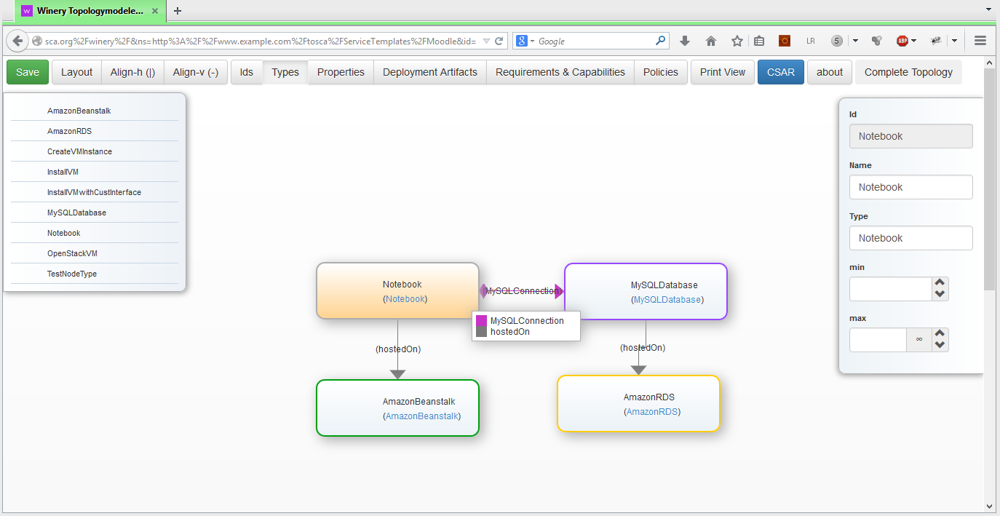

# Topology Modeler

There are two variants of the topology modeler.
One written using Java Server Pages and one written using Angular

## JSP-based Topology Modeler

The main file of the topology modeler is `index.jsp`.
It uses embedded Java code to connect to the repository.
Thereby, the interface `IWineryRepositoryClient` is used.
Afterwards, the whole UI is rendered in `div id="winery"`.

  

The figure shows a screenshot of the topology modeler.
The buttons in the first row are directly contained in `index.jsp`.
The palette on the left side is rendered by `palette.tag`.
The topology in the middle is rendered by a for-loop in index JSP.
This loop iterates over all node templates and uses `nodeTemplateRenderer.tag` to render a single node template.
The relationship templates are drawn using `tmpl:registerConnectionTypesAndConnectNodeTemplates`, whereby `tmpl` is bound to `/WEB-INF/tags/common/templates`.
The property on the right side is rendered by  `propertiesOfOneNodeTemplate.tag` for node templates and by `propertiesOfOneRelationshipTemplate.tag` for relationship templates.

## License

Copyright (c) 2013-2018 Contributors to the Eclipse Foundation

See the NOTICE file(s) distributed with this work for additional
information regarding copyright ownership.

This program and the accompanying materials are made available under the
terms of the Eclipse Public License 2.0 which is available at
http://www.eclipse.org/legal/epl-2.0, or the Apache Software License 2.0
which is available at https://www.apache.org/licenses/LICENSE-2.0.

SPDX-License-Identifier: EPL-2.0 OR Apache-2.0
