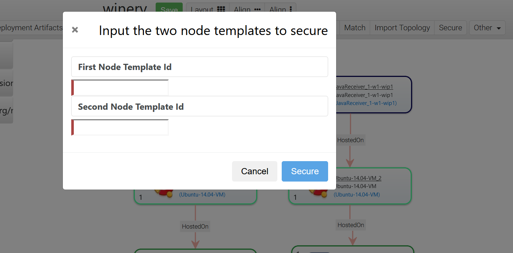

# Securing Topologies

The Topology Modeler can now secure communication channels between nodes. There has to be a direct relationship template between the two Node Templates.
For this functionality to work, Winery has to use a file-based repository and the solution files need to be present in winery-repository/admin/solutions. The nodes needed for the solutions are currently in the repository [tosca-definitions-public](https://github.com/OpenTOSCA/tosca-definitions-public/tree/thesis/create-secure-channels)

To secure the communication between two Node Templates, click on the "Secure" button in the Topology Modeler, input the two Node Template IDs in the modal and press "Secure".

