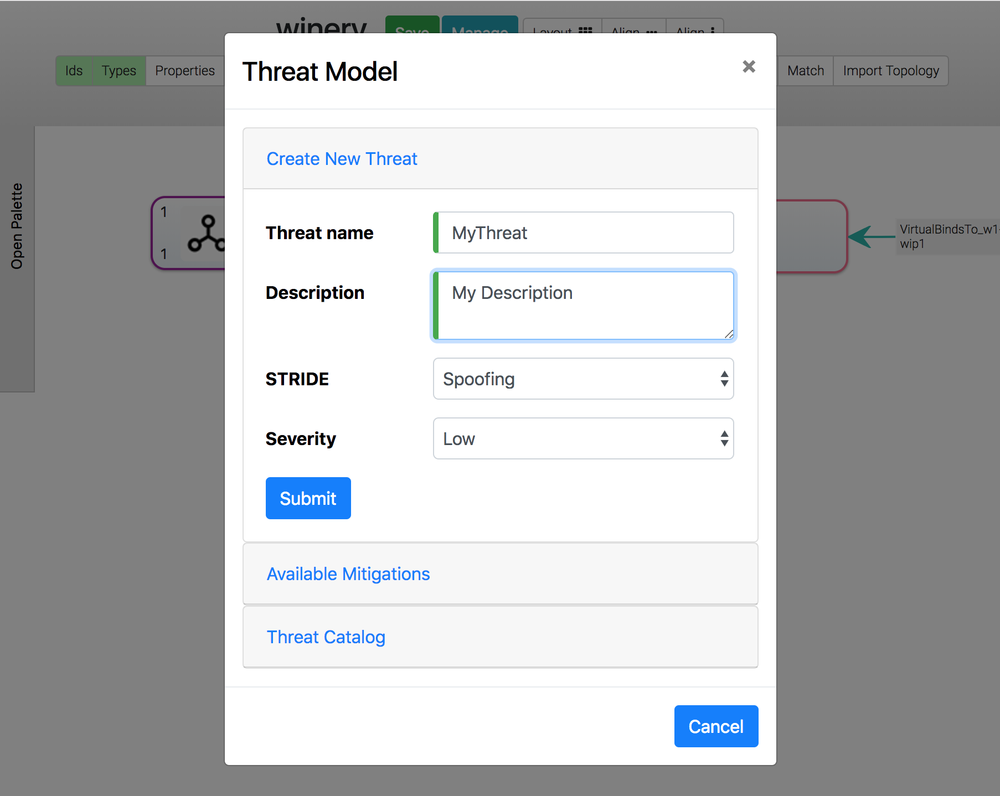
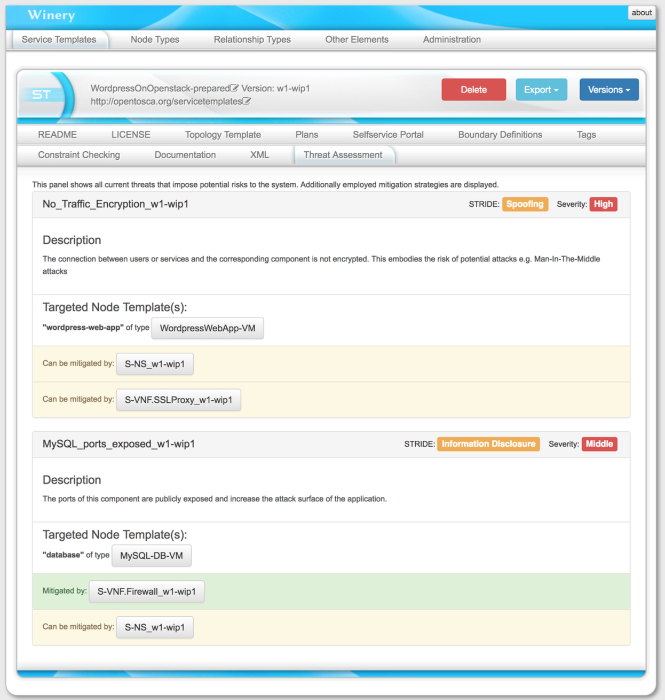

# Threat Modeling for security-aware NFV

Threat modeling enables a user to annotate threats in a topology using a structured approach and receive recommendations which security-related Virtual Network Function (S-VNF) should be used.

This documents specifies how this functionality is intended to be used.
 
## Why threat modeling?
In order to protect something of value, threats that impose risk on a application need to be modeled and assessed.
Network Function Virtualization (NFV) can be used as a component based approach to mitigate a certain class of threats.
For Example a virtual firewall could mitigate the threat of publicly exposed ports of a database.

This way it is possible to create a relation between a threat and a potentially mitigating NFV implementation.
To realize this, this module relies on the presents of two special PolicyTypes and a special NodeType.
The setup of these types is automatically triggered if a new threat is created using the designated UI.
It is assumed that each VNF implementations is encapsulated in it's own ServiceTemplate. 

## Creating threats

A threat is a PolicyTemplate of a special PolicyType ("{http://opentosca.org/threatmodeling}Security.Threat-w1_wip1") and can therefore be created like a regular PolicyTemplate.
The topology modeler UI and repository UI can both be used to create threats. 
However it is recommended to create threats using the designed UI in the topology modler UI.
This way it is ensured that threats are created using the required parameters and the corresponding mitigation is created automatically and set up properly.
[STRIDE](https://docs.microsoft.com/de-de/azure/security/azure-security-threat-modeling-tool-threats) is used as a threat modeling methodology.
Each threat requires a name, a textual description, stride classification and a severity rating in the form of "Low", "Middle" and "High".

## Assigning threats to NodeTemplates
The created threat PolicyTemplate is intended to be used on a NodeTemplate of a topology to indicate that this NodeTemplate is the target of the threat.
This is done in the topology modeler UI.
The Threat Modeling Modal can be used to generate an overview of all available threats under the menu "Threat Catalog" and receive info on description, stride and severity.
Subsequently the desired threat PolicyTemplate has to be assigned like any other PolicyTemplate using the regular UI.

## Assigning mitigations to VNFs
When threats are created using the threat modeling UI (topology modeler) a corresponding mitigation PolicyTemplate is created.
A naming convention of prepending the given threat name with the string "MITIGATE_" is established to ease working with threat and mitigations.
Referencing the corresponding threat is done by using the "ThreatReference" property of the PolicyTemplate.
Here a string representation of the QName of the threat needs to be specified.
Again, this is done automatically when using the UI.

A mitigation PolicyTemplate is intended to be used in the boundary definitions of a ServiceTemplate to indicate that the topology of the ServiceTemplate can be used to mitigate a given threat.
Multiple mitigations can be assigned to the same ServiceTemplate.

## Specifying substitutable NodeTypes for ServiceTemplates
In order to use the topology of a ServiceTemplate in the application topology where threats are present, a substitutable NodeType needs to be specified.
The implemented functionality makes no assumptions how these NodeTypes are modeled besides being abstract and derive from the SVNF NodeType ({http://opentosca.org/nfv/security}S-VNF-w1_wip1).
It is intended to model NodeTypes that inherit from S-VNF (referred to as S-VNF Groups) in a way that multiple VNF implementations can substitute the same S-VFN Group.
All this is done in order to enable users to use abstract NodeTypes in their topologies to hide the underlying complexity and later substitute. Therefore the general rules of substitution apply. 

## Threat assessment and mitigation recommendation
The "Threat Assessment" menu can be viewed in the repository UI on each ServiceTemplate.
An overview of present threats, their targets, and potential mitigation strategies using available VNFs are presented.
This way a detailed look on the current state of the threats is enabled.
Each recommendation can be directly added to the topology by clicking the corresponding button in the "Available Mitigations" part of the threat modeling modal. 

## License

Copyright (c) 2018 Contributors to the Eclipse Foundation

See the NOTICE file(s) distributed with this work for additional
information regarding copyright ownership.

This program and the accompanying materials are made available under the
terms of the Eclipse Public License 2.0 which is available at
http://www.eclipse.org/legal/epl-2.0, or the Apache Software License 2.0
which is available at https://www.apache.org/licenses/LICENSE-2.0.

SPDX-License-Identifier: EPL-2.0 OR Apache-2.0
