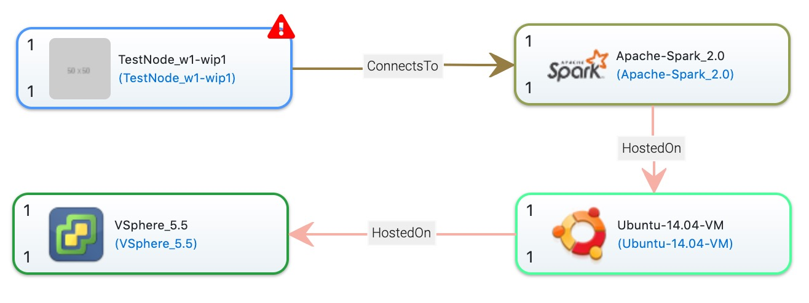

# Update Management of Node Templates in Topology Modeler

This guide shows an overview of how to update a Node Template in a Topology Template. 

## Steps to update a Node Template    

User will be informed with a *red exclamation mark* when there's any new versions available for a node template.

Select the version to update.

A table with new, removed and resolved Properties will be shown. A new *Property* and a removed *Property* can be selected so that the value will be transferred.

Now the Node Template is updated in the Topology Template. New Properties are available and values are transferred.

To confirm the update above, save the topology template.

## License

Copyright (c) 2019 Contributors to the Eclipse Foundation

See the NOTICE file(s) distributed with this work for additional
information regarding copyright ownership.

This program and the accompanying materials are made available under the
terms of the Eclipse Public License 2.0 which is available at
http://www.eclipse.org/legal/epl-2.0, or the Apache Software License 2.0
which is available at https://www.apache.org/licenses/LICENSE-2.0.

SPDX-License-Identifier: EPL-2.0 OR Apache-2.0
