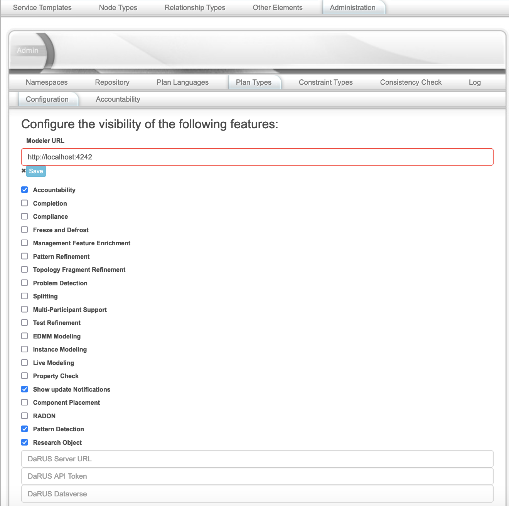
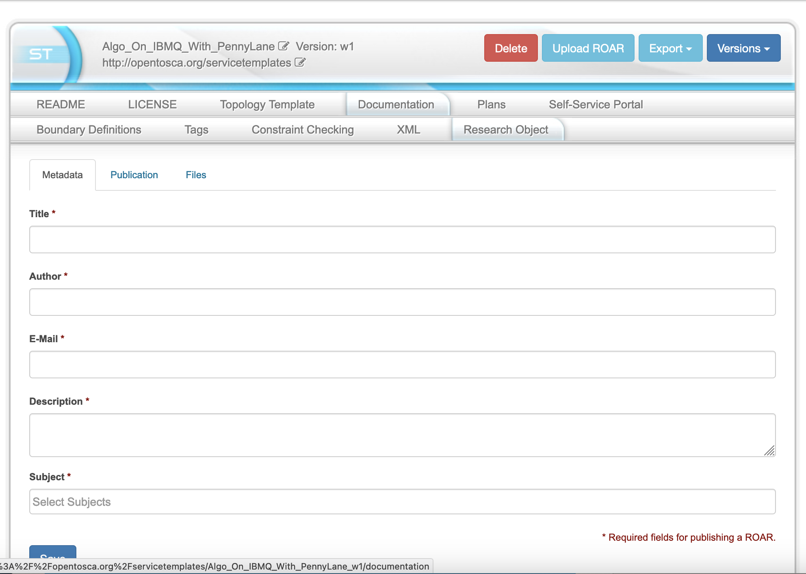
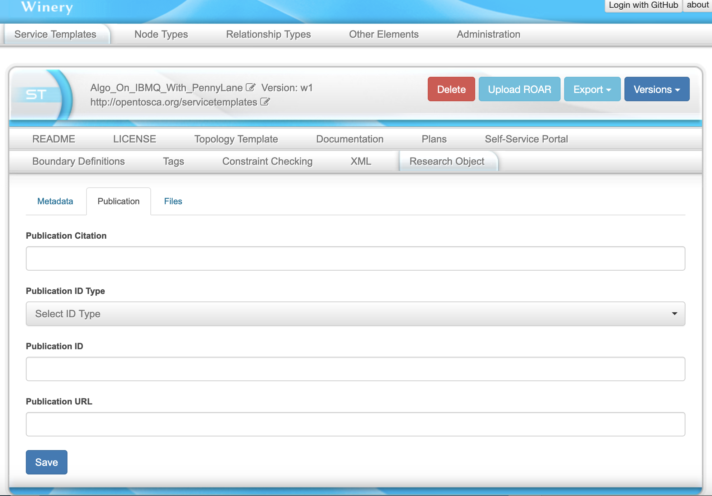
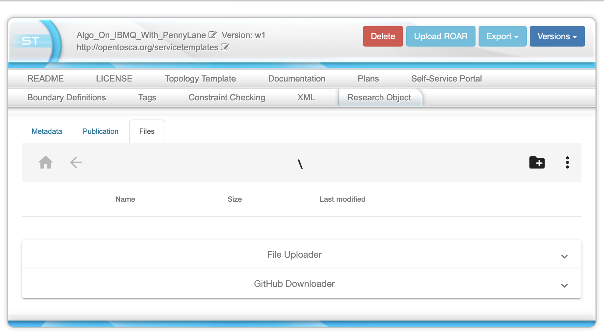
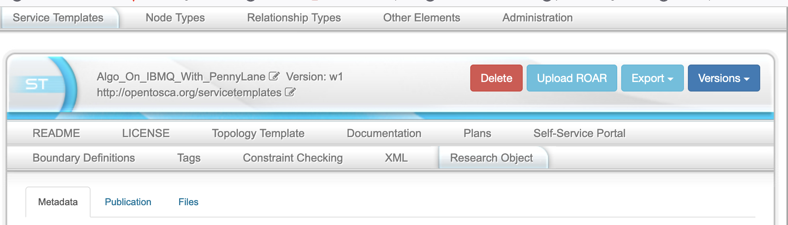

<!---~~~~~~~~~~~~~~~~~~~~~~~~~~~~~~~~~~~~~~~~~~~~~~~~~~~~~~~~~~~~~~~~~~~~~~~~~~~
  ~ Copyright (c) 2023 Contributors to the Eclipse Foundation
  ~
  ~ See the NOTICE file(s) distributed with this work for additional
  ~ information regarding copyright ownership.
  ~
  ~ This program and the accompanying materials are made available under the
  ~ terms of the Eclipse Public License 2.0 which is available at
  ~ http://www.eclipse.org/legal/epl-2.0, or the Apache Software License 2.0
  ~ which is available at https://www.apache.org/licenses/LICENSE-2.0.
  ~
  ~ SPDX-License-Identifier: EPL-2.0 OR Apache-2.0
  ~~~~~~~~~~~~~~~~~~~~~~~~~~~~~~~~~~~~~~~~~~~~~~~~~~~~~~~~~~~~~~~~~~~~~~~~~~~~-->

# Creating Research Object Archives (ROARs)
ROARs enable the packaging, publishing, and installation of research software using a self-contained and portable packaging format.
In addition, all important information of research software, especially its technical dependencies, related research data, descriptive metadata, licenses, and references to corresponding publications can be bundled within a ROAR.
The main motivation is to make research software more findable, accessible, interoperable, and reusable.

###*Notes*
+ A short overview of TOSCA can be found [here](https://github.com/OpenTOSCA/opentosca-docker/blob/main/docs/tosca-glossary.md).
+ You should have a look at the [Winery User Guide](http://eclipse.github.io/winery) before reading this tutorial to get all the basic knowledge about Winery.
+ To get Winery up and running easily, you can use our [Docker Compose Setup](https://github.com/OpenTOSCA/opentosca-docker).
+ A guide to model applications can be found [here](https://github.com/OpenTOSCA/opentosca-docker/blob/main/docs/tutorial-model-and-deploy.md).
+ A guide to create Node Types can be found [here](https://github.com/OpenTOSCA/opentosca-docker/blob/main/docs/tutorial-node-implementation.md).
+ Information about the License-Check feature can be found [here](./license-checker.md).

## How to use the ROAR-feature 

### Step 1: Start Winery

If you need help getting Winery up and running have a look at the [Quickstart Guide](http://eclipse.github.io/winery).

### Step 2: Enable the ROAR-feature

First click on the *Administration* tab on top and then go to *Configuration*.
Next enable the *Research Object* feature.
After that, you can enter the required information:
+ The Endpoint of [DaRus](https://darus.uni-stuttgart.de/) (or any other [Dataverse](https://dataverse.org/) instance) the ROARs should be stored at
+ Your personal API Token
+ The dataverse, the ROAR should be added to

### Step 3: Add Metadata
In the *Metadata* tab, you can add basic meta information to your ROAR, e.g., title and author, which is required for publishing it to the remote DaRus server.

### Step 4: Add Publication
In the *Publication* tab, you can reference related publications.

### Step 5: Add files

In the *Files* tab, you can upload files which should be part of your ROAR.
File can be uploaded locally from your machine as well as downloaded directly from GitHub by providing a GitHub repository and the branch name.
Files can also be organized in directories, moved and deleted.

### Step 6: Upload the ROAR
After finishing the modeling, the ROAR can be uploaded to DaRUS.
In order to do that, you need to click the *Upload ROAR* button.
After that, the upload progress as well as the reference of the uploaded ROAR on DaRus is shown.

