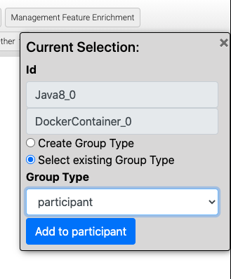
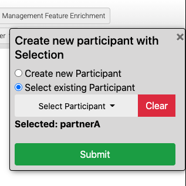

<!---~~~~~~~~~~~~~~~~~~~~~~~~~~~~~~~~~~~~~~~~~~~~~~~~~~~~~~~~~~~~~~~~~~~~~~~~~~~
  ~ Copyright (c) 2020 Contributors to the Eclipse Foundation
  ~
  ~ See the NOTICE file(s) distributed with this work for additional
  ~ information regarding copyright ownership.
  ~
  ~ This program and the accompanying materials are made available under the
  ~ terms of the Eclipse Public License 2.0 which is available at
  ~ http://www.eclipse.org/legal/epl-2.0, or the Apache Software License 2.0
  ~ which is available at https://www.apache.org/licenses/LICENSE-2.0.
  ~
  ~ SPDX-License-Identifier: EPL-2.0 OR Apache-2.0
  ~~~~~~~~~~~~~~~~~~~~~~~~~~~~~~~~~~~~~~~~~~~~~~~~~~~~~~~~~~~~~~~~~~~~~~~~~~~~-->

# Grouping  

The Grouping feature of Winery enables to describe groups of node templates within a topology template.
This enables the possibility to express that a set of node templates belong to each other given a certain semantic, for example, to describe that, within a topology template, a group of node templates is deployed on AWS, while another group of node templates is deployed on OpenStack.
The grouping feature can be used to create or view groups of arbitrary semantics within a topology template.

## Tutorial

In the following, a simple example is given describing how to use the Grouping feature of Winery.
We will describe how to create multiple groups, how to get an overview of existing groups, and how to remove node templates from groups, or even remove an entire group including its members.

Note: You should have a look at the [Winery User Guide](http://eclipse.github.io/winery) before reading this tutorial to get all the basic knowledge about Winery.

### Step 1: Start Winery

If you need help getting Winery up and running have a look at the [Quickstart Guide](http://eclipse.github.io/winery)

### Step 2: Open/Create a Topology Template

First, we need to open a Topology Template in the TOSCA topology model editor.
If no service template exists, create one according to [this tutorial](../yml/index.rst)
Once a service template exists, select the tab "Service Templates" in Winery, then open an arbitrary service template by clicking on it.
Next, click on the "Topology Template" tab within the opened service template, and select "Open Editor" to start the TOSCA topology model editor for this topology template.

### Step 3: Create a Group

To create a group, just mark one or more node templates in the TOSCA topology model editor as shown below.

Once the mouse is released, a menu pops up on the right showing the marked node templates.
Based on the selection, it is possible to create a new group.
To do this, a group type needs to be selected that defines the semantics of the group to be created.
Currently, two group types are supported, i.e., (i) *location*, and (ii) *participant*.
A location group is used to define a group of node templates that is to be deployed to a location, for example to the AWS Cloud.
A participant group defines a group of node templates that belong to one participant in a multi-participant scenario.
Further, it is possible to define custom group types.

For example, in the shown figure, the group type *participant* is selected.
With the button *Add to Participant*, the user is able to define a name for the group, for example *PartnerA*, and an endpoint for the invocation of the deployment of the selected node templates as shown below.

Once a group exists, it is also possible to add a selection of node templates to an existing group as shown below.

### Step 4: View and Delete Groups

Once a group was created, it is possible to view the currently existing groups as shown below by clicking on *Group View* in the menu panel.
When hovering over a group, the node templates of that group are highlighted. 

Furthermore, it is possible to remove a node template from a group, or to remove a group of node templates, or to remove all groups of a group type entirely by clicking on the *X* of the respective entity.
