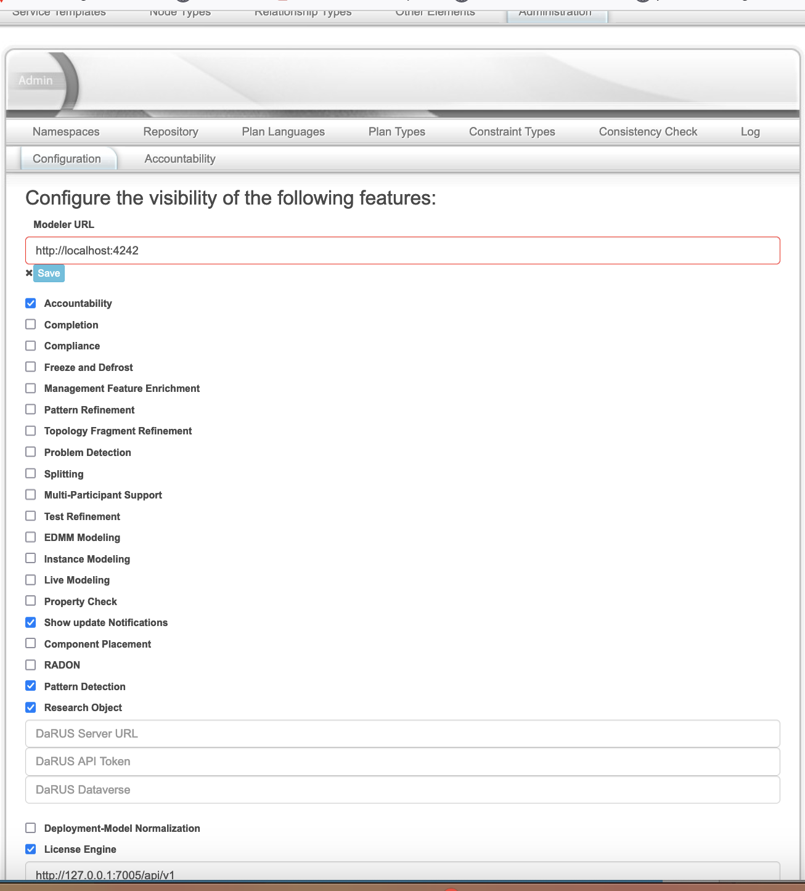
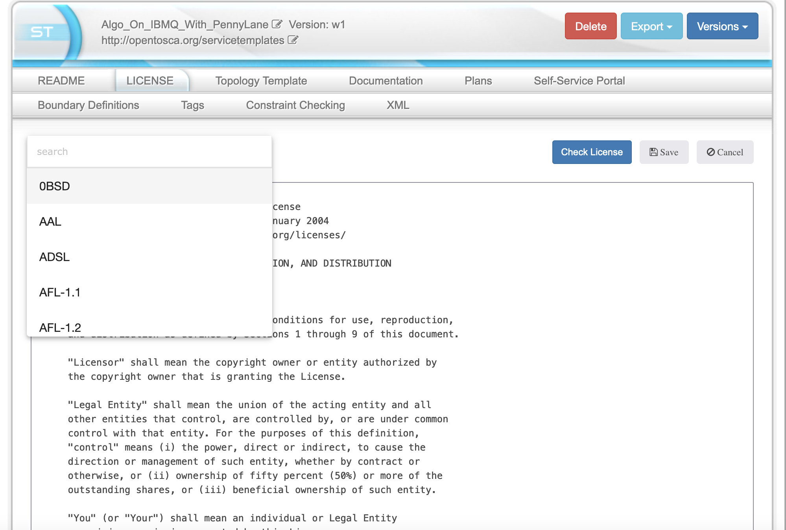
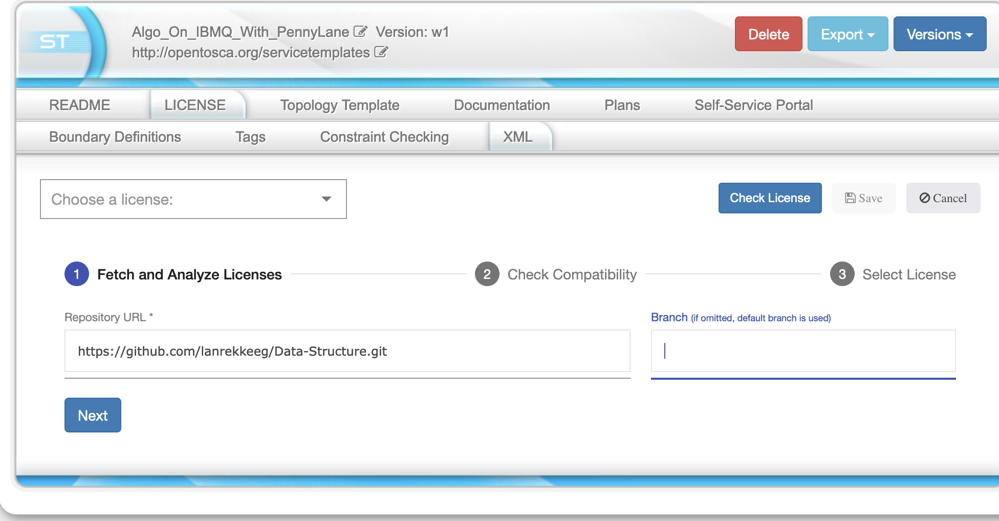
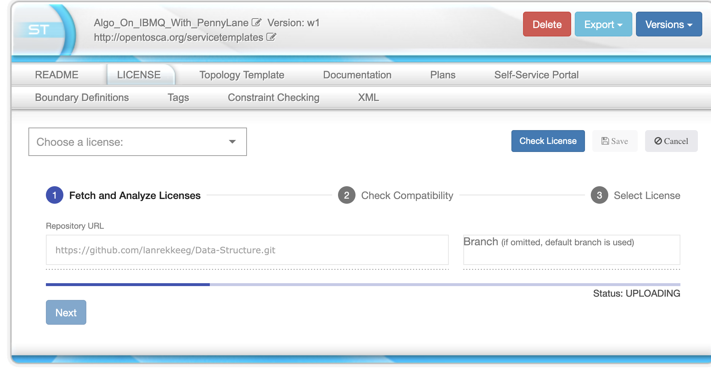
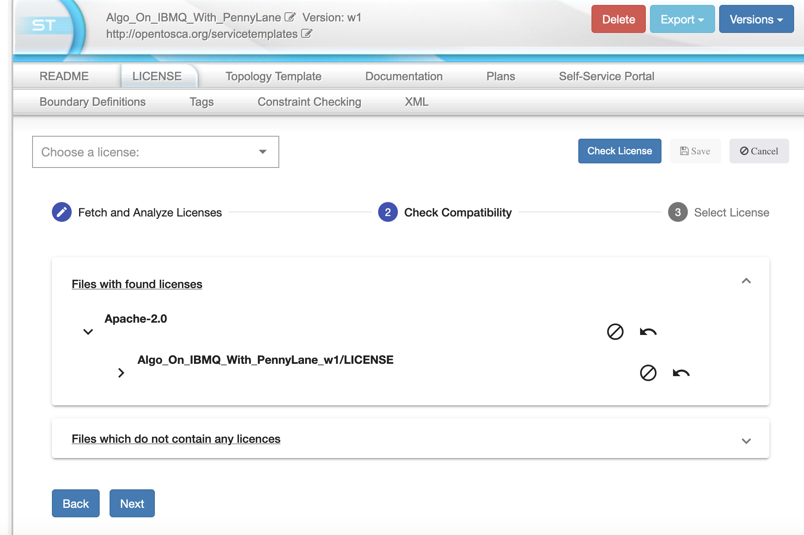
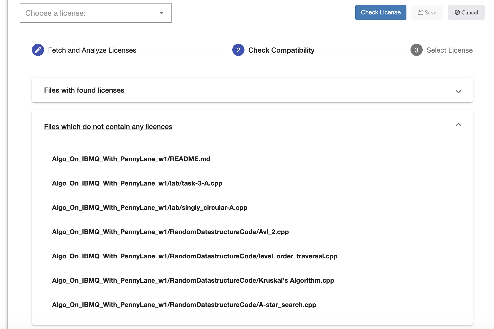
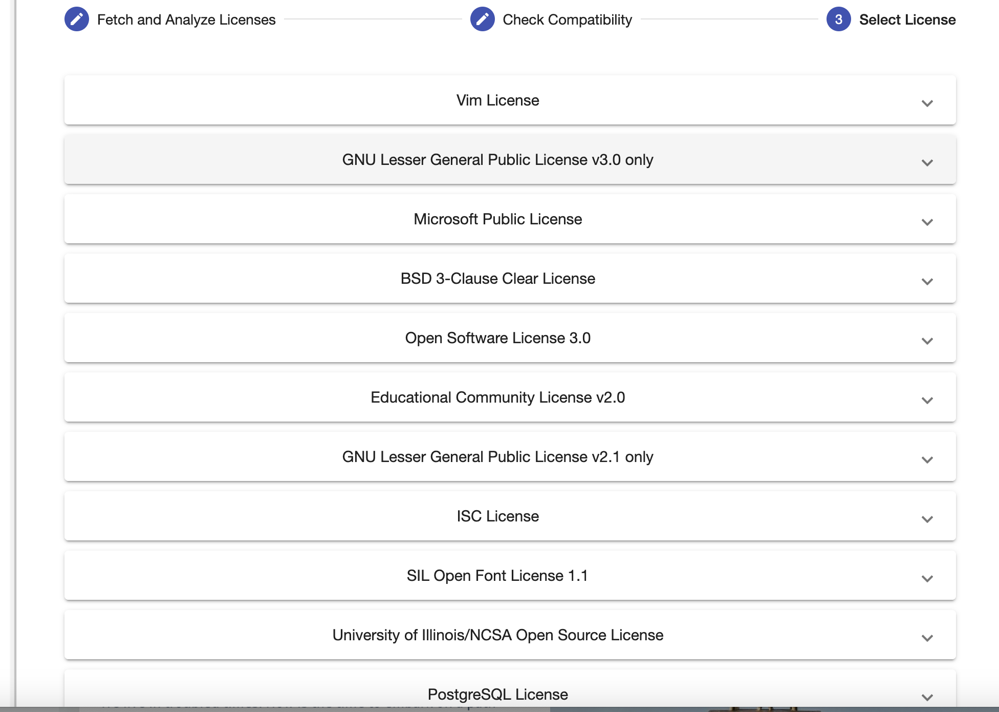
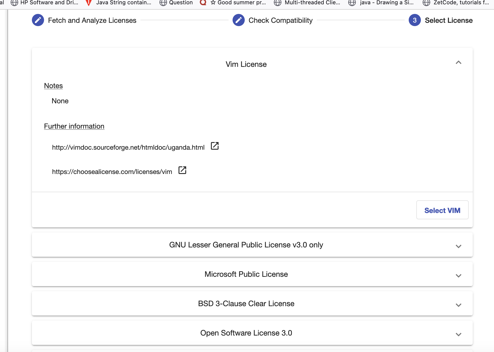
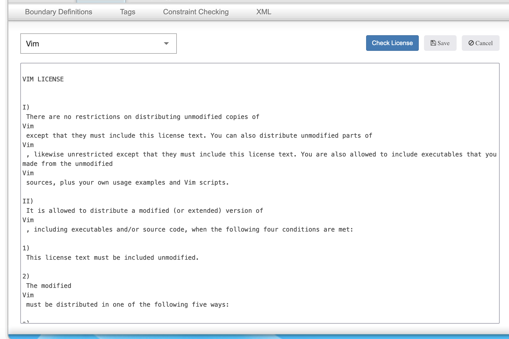

<!---~~~~~~~~~~~~~~~~~~~~~~~~~~~~~~~~~~~~~~~~~~~~~~~~~~~~~~~~~~~~~~~~~~~~~~~~~~~
  ~ Copyright (c) 2023 Contributors to the Eclipse Foundation
  ~
  ~ See the NOTICE file(s) distributed with this work for additional
  ~ information regarding copyright ownership.
  ~
  ~ This program and the accompanying materials are made available under the
  ~ terms of the Eclipse Public License 2.0 which is available at
  ~ http://www.eclipse.org/legal/epl-2.0, or the Apache Software License 2.0
  ~ which is available at https://www.apache.org/licenses/LICENSE-2.0.
  ~
  ~ SPDX-License-Identifier: EPL-2.0 OR Apache-2.0
  ~~~~~~~~~~~~~~~~~~~~~~~~~~~~~~~~~~~~~~~~~~~~~~~~~~~~~~~~~~~~~~~~~~~~~~~~~~~~-->

# License checking feature

### How to enable it
First click on the *Administration* tab on top and then go to *Configuration*.
Next enable the *License Engine* feature.
After that, you can enter the endpoint of a running [License Engine](https://github.com/OpenTOSCA/license-engine) instance.

### How to use it

When you click on *LICENSE*, you can either select a license manually via the dropdown menu or click *Check License* to use the License Engine to find the used licenses in your source code.
 

After clicking on *Check License* you can enter the GitHub repository URL and the branch name of the application to check for licenses.

After entering all information and clicking on *Next*, the check will start and the progress is shown on the bottom.

When the check is finished, an overview of the checked files and found licenses is given.
Here, all files which define a license are shown as well as those files that do not define any license.
With the buttons on the right side, you can exclude files from the compatibility check if you want.
This can be done to exclude files that are only needed for building or testing the application, for example.
The compatibility check of the licenses is started after clicking on *Next*.

When the compatibility check is finished, a list of all compatible licenses (to the found licenses of the application) is shown.

By clicking on a license entry, you can get further information about this license.
After deciding which license to chose, you have to click on *Select [License]* on the bottom right of the specific license.

This will automatically add the license text of the selected license.
If you want to, you can now modify the license text, e.g., to add your name or the date and click on *Save* to save it.

