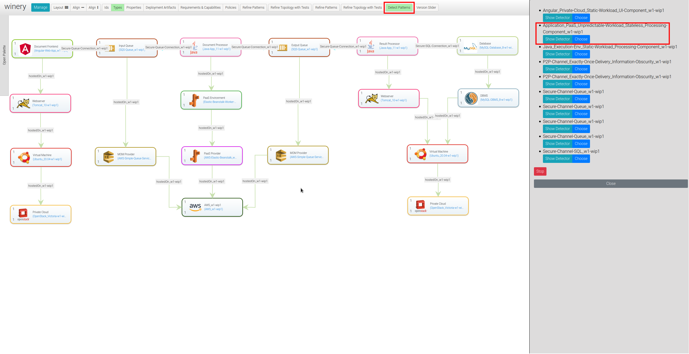
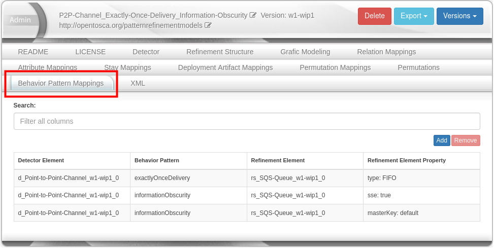

<!---~~~~~~~~~~~~~~~~~~~~~~~~~~~~~~~~~~~~~~~~~~~~~~~~~~~~~~~~~~~~~~~~~~~~~~~~~~~
  ~ Copyright (c) 2021 Contributors to the Eclipse Foundation
  ~
  ~ See the NOTICE file(s) distributed with this work for additional
  ~ information regarding copyright ownership.
  ~
  ~ This program and the accompanying materials are made available under the
  ~ terms of the Eclipse Public License 2.0 which is available at
  ~ http://www.eclipse.org/legal/epl-2.0, or the Apache Software License 2.0
  ~ which is available at https://www.apache.org/licenses/LICENSE-2.0.
  ~
  ~ SPDX-License-Identifier: EPL-2.0 OR Apache-2.0
  ~~~~~~~~~~~~~~~~~~~~~~~~~~~~~~~~~~~~~~~~~~~~~~~~~~~~~~~~~~~~~~~~~~~~~~~~~~~~-->

# Pattern Detection in Declarative Deployment Models

**IMPORTANT NOTE**: To use this feature, you must have the `Pattern Detection` feature enabled which is available in the `Configuration` tab underneath the `Administration`.

By using the PRMs/CBPRMs introduced for pattern refinement, patterns can be detected in topologies (see [Pattern Deployment Modeling](pattern-deployment-modeling.md) for further reference).
During pattern refinement, the subgraph of a topology is matched using the Detector of a PRM and then replaced by its Refinement Structure.
During pattern detection, the subgraph of a topology is matched using the Refinement Structure of a PRM and then replaced by its Detector.
The following picture shows the pattern detection process for a topology:



The pattern detection process can be triggered in the topology modeler by clicking the _Detect Patterns_ button.
If the button is clicked, a sidebar opens up listing all matching PRMs.
A PRM can be selected for application or its Detector can be viewed by the respective buttons.
NOTE: only PRMs with ```isPdrm="yes"``` are considered during pattern detection.

## Behavior Pattern Mappings

To improve the detection of patterns, Behavior Pattern Mappings can be added to PRMs as shown in the following picture:



A Behavior Pattern defines the relationship between a Behavior Pattern (modeled as Policy), and a Property required to implement it.
If a Behavior Pattern requires multiple Properties to be implemented, multiple Behavior Pattern Mappings need to be defined.
PRMs which provide Behavior Pattern Mappings can be used during pattern detection even if they do not match completely.
If not all Properties required by a Behavior Pattern are set as defined by the Behavior Pattern Mappings, the Behavior Pattern is removed during replacement of the subgraph.
