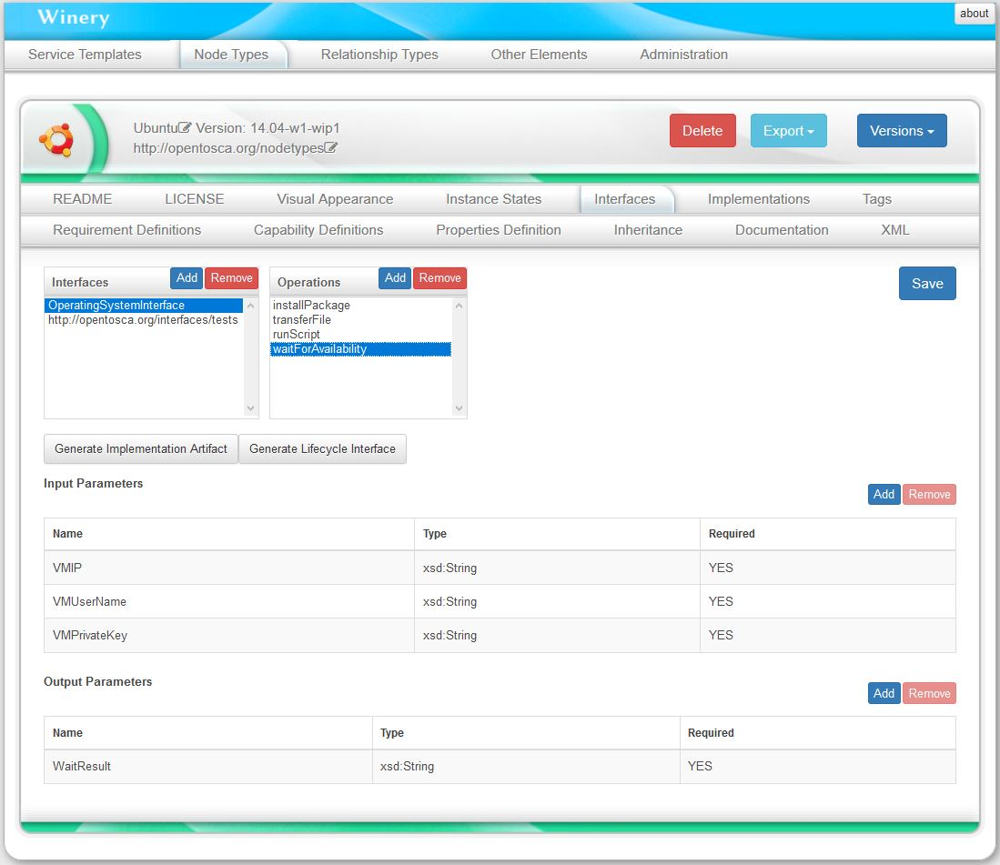

# Generate an Implementation Artifact for a Node Type Interface

To specify what a node type should do, the user can define an *interface* and the *operations* provided by this interface. 
Once the operations of a node type are defined, artifacts (e.g., shell scripts, .war files) implementing these operations need to be modeled. 
For this, Winery provides an option to **automatically generate a stub java maven project** to build a **.war file** for a defined interface. 
This can be done in the *Interface* tab of the node type view by pressing *Generate Implementation Artifact*. 
A node type implementation will be automatically generated as well, if it does not exist yet.
Once you get a confirmation that the artifact was generated, please press *Save*.

 
 
To download the generated stub java main project, go to the detailed view of the artifact template and press *ZIP*. 
 
 
 
Unzip the archive generated by Winery into a location of your choice. In the root folder, you can find a *README.txt* explaining in details how to edit, build and upload the .war file to the implementation artifact in Winery. 
A summary of this is provided below.
For the next steps, maven and Eclipse are required. Furthermore, maven commands are executed in the root folder of the implementation artifact.
 
## Create an Eclipse Project
 - Run: mvn eclipse:eclipse
 - Open Eclipse
 - *File* -> *Import* -> *Existing Project into Workspace* -> click *Next*
 - Click *Browse* and select folder where you unzipped the generated implementation artifact
 - Select the project from the list and click *Finish*
 
## Test your Implementation Artifact
 - Run: mvn clean package tomcat7:run-war
 - Open this page to see the list of available services: http://localhost:9090/services/
 - This page also links the WSDL
 - With the WSDL your're able to test your IA using SOAPui or other tools.
 
## Upload your Implementation Artifact
 You have two options to do this:
 
### 1) Automatically (to the Winery instance this IA project was generated with)
 - Run: mvn deploy
 - The WAR is directly uploaded into the correct ArtifactTemplate, previous versions will be overwritten.
 
### 2) Manually
 - Run: mvn clean package
 - Locate the WAR file in the /target folder
 - Open Winery in your browser, locate the artifact template representing this implementation artifact.
 - Upload the WAR file to the artifact template in the tab *Files*

## License

Copyright (c) 2018 Contributors to the Eclipse Foundation

See the NOTICE file(s) distributed with this work for additional
information regarding copyright ownership.

This program and the accompanying materials are made available under the
terms of the Eclipse Public License 2.0 which is available at
http://www.eclipse.org/legal/epl-2.0, or the Apache Software License 2.0
which is available at https://www.apache.org/licenses/LICENSE-2.0.

SPDX-License-Identifier: EPL-2.0 OR Apache-2.0
