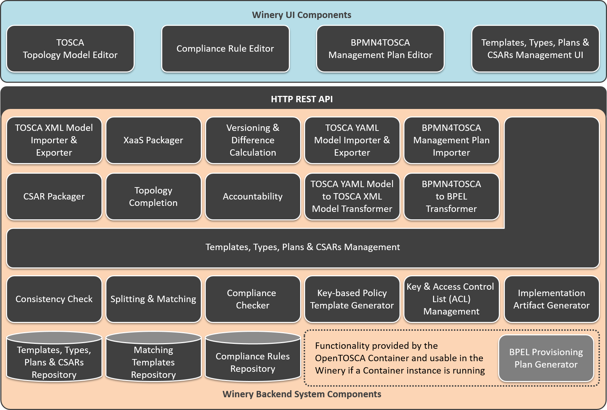

# Overview

Winery consists of four parts (1) the type and template management, (2) the topology modeler, (3) the BPMN4TOSCA plan modeler, and (4) the repository.

The type, template and artifact management enables managing all TOSCA types, templates and related artifacts.
This includes node types, relationship types, policy types, artifact types, artifact templates, and artifacts such as virtual machine images.

The topology modeler enables to create service templates.
Service templates consists of instances of node types (node templates) and instances of relationship types (relationship templates).
They can be annotated with requirements and capabilities, properties, and policies.

The BPMN4TOSCA plan modeler offers web based creation of BPMN models with the TOSCA extension BPMN4TOSCA.
That means the modeler supports the BPMN elements and structures required by TOSCA plans and not the full set of BPMN [KBBL12].
This part is currently in development and not part of the opensourced code of Winery.

The repository stores TOSCA models and allows managing their content. For instance, node types, policy types, and artifact templates are managed by the repository.
The repository is also responsible for importing and  exporting CSARs, the exchange format of TOSCA files and related artifacts.

## License

Copyright (c) 2017-2018 Contributors to the Eclipse Foundation

See the NOTICE file(s) distributed with this work for additional
information regarding copyright ownership.

This program and the accompanying materials are made available under the
terms of the Eclipse Public License 2.0 which is available at
http://www.eclipse.org/legal/epl-2.0, or the Apache Software License 2.0
which is available at https://www.apache.org/licenses/LICENSE-2.0.

SPDX-License-Identifier: EPL-2.0 OR Apache-2.0
