# Quickstart

These steps ensure that

- You have a set of TOSCA definitions
- Winery sees that TOSCA definitions when you start it.

## Windows

Winery has built-in "magic" to check for existance of `C:\winery-repository`.
If that directory exists, this is used as repository location.
If that directory does not exists, it uses the home directory, which is `%HOME%` defaulting to `C:\Users\USERNAME\winery-repository`.

1. Ensure that git and [git-lfs](https://git-lfs.github.com/) are installed.
    1. Installation using [chocolatey](https://chocolatey.org/): `choco install git git-lfs`
    1. Manual installation:
        - Download git installer form <https://git-scm.com/downloads> and execute it.
        - Download git-lfs installer from <https://git-lfs.github.com/> and execute it.
1. Make repository available.
    1. `mkdir c:\winery-repository`. The name `winery-repository` is important, because of Winery's magic (see above)
    2. `cd c:\winery-repository`
    2. `git config --global core.longpaths true` to enable long paths. Works perfectly on Windows.
    3. `git clone https://github.com/winery/test-repository.git .` to clone the [test repository](https://github.com/winery/test-repository).
    3. Execute `git lfs install`
    4. Uni Stuttgart developers:
        1. `git remote add tosca-definitions-internal https://github.com/OpenTOSCA/tosca-definitions-internal/` to make the [tosca-definitions-internal](https://github.com/OpenTOSCA/tosca-definitions-internal/) known.
        1. `git fetch tosca-definitions-internal` - to fetch the tosca-definitions repository
    6. `git checkout black` - to switch to the main branch of the test repository
    7. Result: Now you are at the [test repository](https://github.com/winery/test-repository) containing testing types.
       If you do `git checkout master`, you are seeing the [OpenTOSCA TOSCA Definitions repository](https://github.com/OpenTOSCA/tosca-definitions/).

## Mac OS X

Winery stores its repository at `~/winery-repository`.

This howto is currently incomplete.

1. Ensure that git and [git-lfs](https://git-lfs.github.com/) are installed.
    1. `brew install git-lfs`

## Modeling a Topology in Winery
The following shows how to model new node types and how to use them at the modeling of a new service template. 
In this example, the runtime **Python3** shall be installed on an **Ubuntu 14.04** virtual machine running on an **Openstack** infrastructure. 
For this, we require three node types. 
In this example, we model two node types, Python3 and Ubuntu 14.04, and assume that the OpenStack node type was previously modeled.

### Creating a new Node Type

By selecting the tab *Node Types*, a list of available node types is shown. 
To create a new node type, press the button *Add new*. 

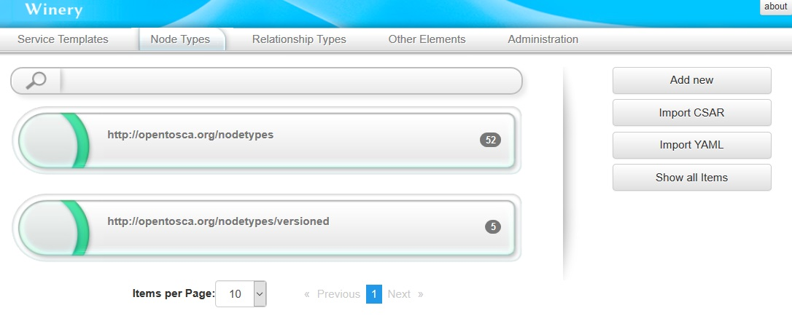

This will open a dialog in which the *Name*, *Component version*, and *Namespace* of the new node type can be configured.

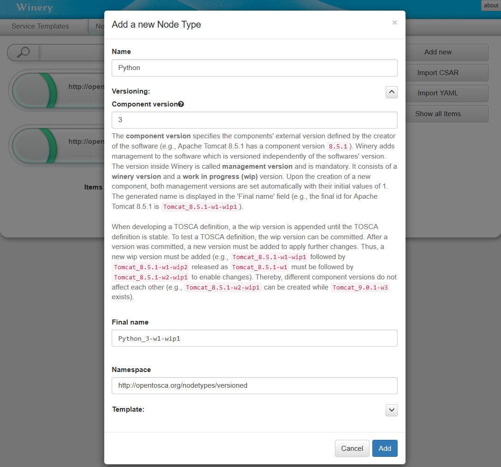

Once the node type is created, it can be further configured through different tabs of its detailed view.

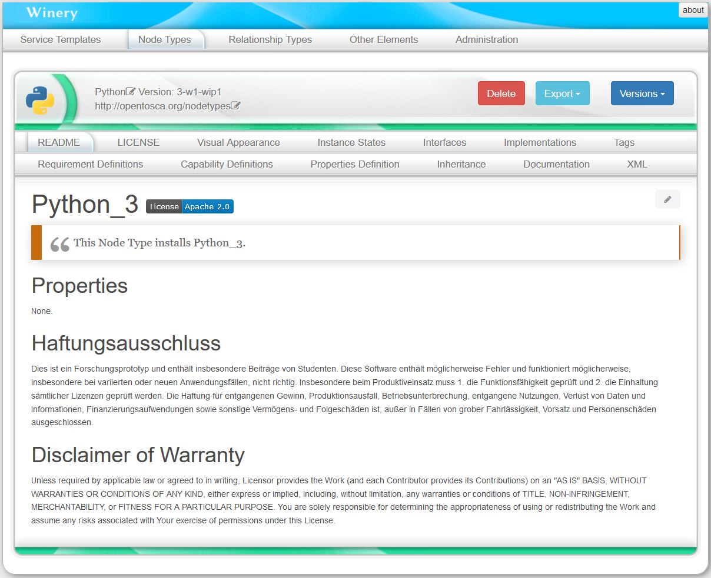

For example, to add properties to the node type, select the tab *Properties Definition*. 

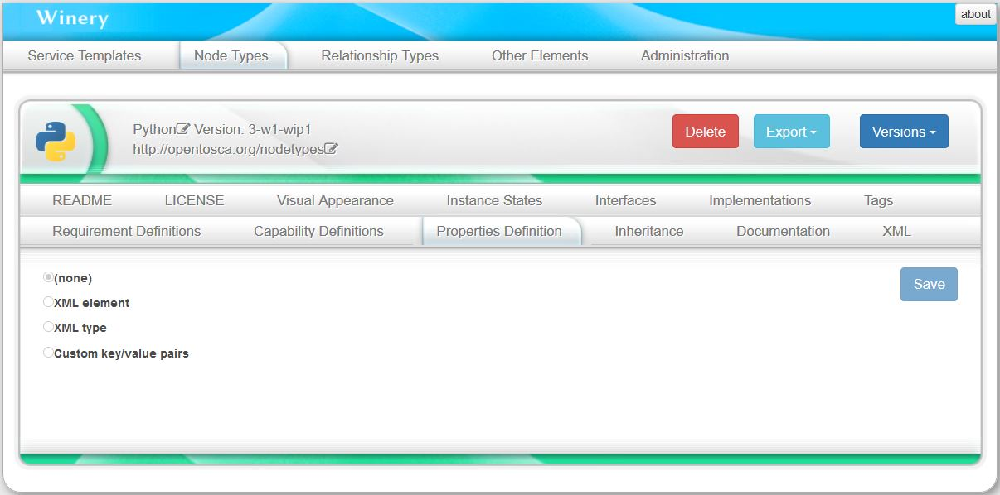

In this example, the Python3 node type does not require any properties.

### Modeling the Node Type Interface

To specify what the *Python3* node type should do, we define an *interface* and the *operations* provided by this interface.
An interface containing lifecycle operations (install, configure, start, stop, uninstall) can be automatically generated, however, any arbitrary interface can be created.

To generate a lifecycle interface, press *Generate Lifecycle Interface* and *Save*.
For the node type Python3, we only use the operation *install*. 

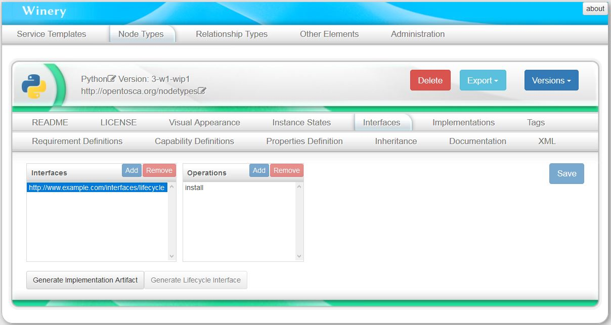

### Modeling an Artifact Template for a Node Type Operation

Once the operations of a node type are defined, artifacts (e.g., shell scripts, .war files) implementing these operations need to be modeled. 
In this example, we have a *shell script* to install Python3 on Ubuntu, which we model as an artifact template.
 
To create an artifact template, select the tab *Other Elements*, under the category *Artifacts* select the option *Artifact Templates*, and press the button *Add new*. 

This will open a dialog in which the *Name*, *Versioning*, *Type*, and *Namespace* of the artifact template can be configured. 
Assuming that some artifact types were previously modelled, choose the type *ScriptArtifact*.

Once the artifact template is created, it can be further configured through different tabs of its detailed view.

Finally, to load th install script to the artifact template, select the tab *Files*, and drop the file into the drop zone.

### Modeling the Node Type Implementation

To create a node type implementation, select the tab *Other Elements*, under the the category *Implementations* select the option *Node Type Implementations*, and press the button *Add new*.
This will open a dialog in which the *Name*, the corresponding node *type*, and *Namespace* of the node type implementation can be configured. By type, select the node type we created before.

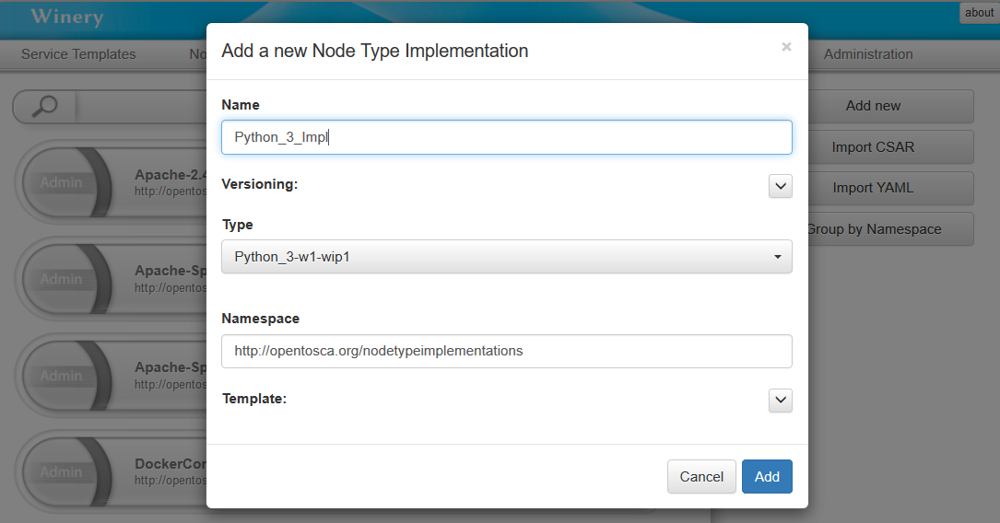

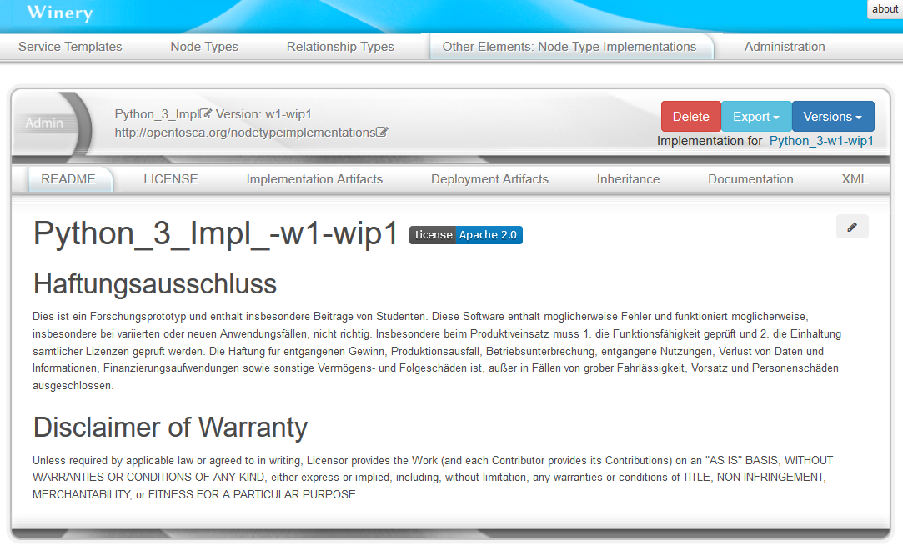

To link the created artifact template to this node type implementation, select the tab *Implementation Artifacts* and press the button *Add*.
In the shown dialog, choose the option *Link Artifact Template*, then select the artifact template that was previously created.

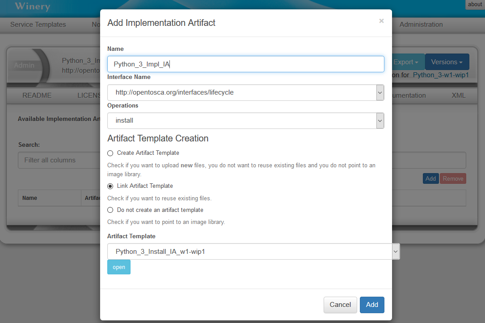

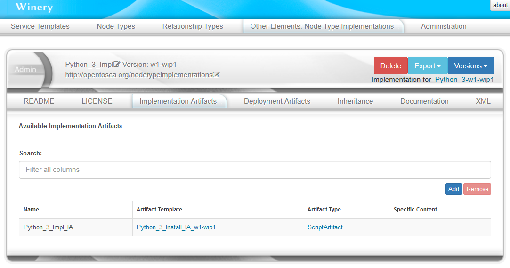

### Modeling the Ubuntu Node Type

The modeling of the Ubuntu node type is similar to the modeling of the Python3 node type.

However, the artifact templates for the Ubuntu 14.04 are *.war files* instead of *shell scripts*. In this case, after defining the *interfaces* and *operations* of the Ubuntu node type, we can automatically generate a stub java maven project to build a *.war file* for a defined interface. For this, press *Generate Implementation Artifact*. The node type implementation will be automatically generated as well.

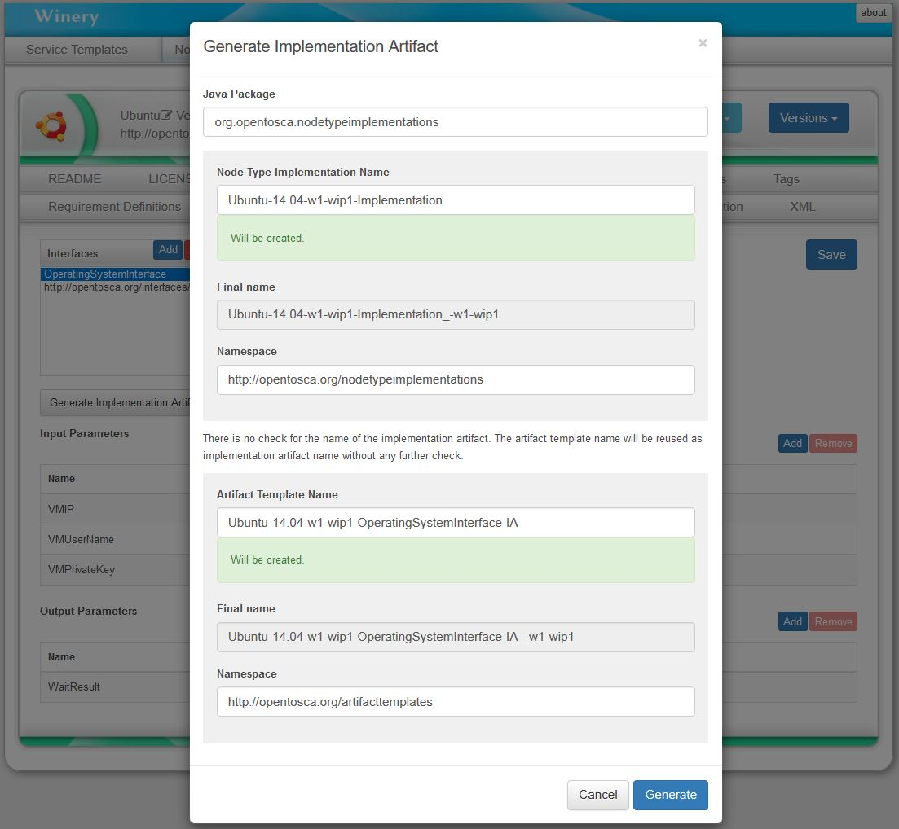

After editing the generated stub project, we can built it and load the resulting .war file to the artifact template in the tab *Files*.

### Creating the Service Template

To finally model the service template, at the tab *Services Templates*, press *Add new*.

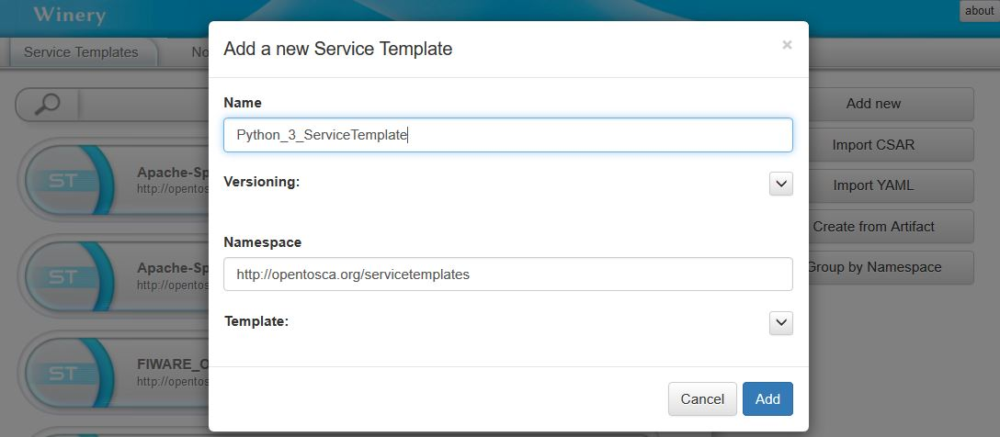

Go to tab *Topology Template* and press the button *Open Editor*.  

In the editor, the *Palette* on the left shows the available node types, which can be drag and dropped in the modelling area. 

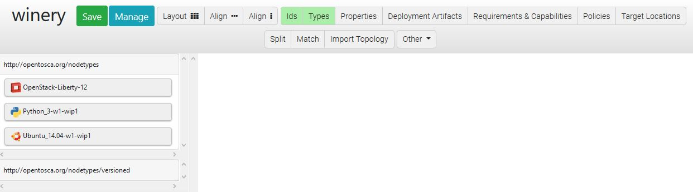

To model the relationship that the Python3 runtime is hosted on the Ubuntu virtual machine, click at the Python3 node template. This will show a list of possible relationship types (previously modelled). Click in the option *HostedOn* and  pull the shown arrow to the Ubuntu node template area, in order to connect these node templates.

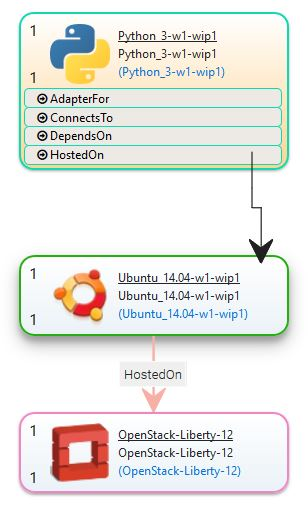

### Exporting a Service Template Package

To export the Service Template as a CSAR package, press *Other*, then *Export CSAR*.

## License

Copyright (c) 2017-2018 Contributors to the Eclipse Foundation

See the NOTICE file(s) distributed with this work for additional
information regarding copyright ownership.

This program and the accompanying materials are made available under the
terms of the Eclipse Public License 2.0 which is available at
http://www.eclipse.org/legal/epl-2.0, or the Apache Software License 2.0
which is available at https://www.apache.org/licenses/LICENSE-2.0.

SPDX-License-Identifier: EPL-2.0 OR Apache-2.0
