.. Copyright (c) 2020 Contributors to the Eclipse Foundation

.. See the NOTICE file(s) distributed with this work for additional
.. information regarding copyright ownership.

.. This program and the accompanying materials are made available under the
.. terms of the Eclipse Public License 2.0 which is available at
.. http://www.eclipse.org/legal/epl-2.0, or the Apache Software License 2.0
.. which is available at https://www.apache.org/licenses/LICENSE-2.0.

.. SPDX-License-Identifier: EPL-2.0 OR Apache-2.0

Modeling based on TOSCA XML (deprecated) 
########################################

This guide shows an overview of how to model TOSCA node types and service templates using Winery.
Before starting this guide, please take a look at :ref:`Miscellaneous Notes`.

The following shows how to model new node types and how to use them at the modeling of a new service template. 
In this example, the runtime **Python3** shall be installed on an **Ubuntu 14.04** virtual machine running on an **Openstack** infrastructure. 
For this, we require three node types. 
In this example, we model two node types, Python3 and Ubuntu 14.04, and assume that the OpenStack node type was previously modeled.

Creating a new Node Type
************************

By selecting the tab *Node Types*, a list of available node types is shown. 
To create a new node type, press the button *Add new*. 

.. image:: 1-AddNewNodeType.jpg
   :width: 600

This will open a dialog in which the *Name*, *Component version*, and *Namespace* of the new node type can be configured.

.. image:: 2-AddNewNodeType.png
   :width: 600

Once the node type is created, it can be further configured through different tabs of its detailed view.

.. image:: 3-AddNewNodeType.jpg
   :width: 600

For example, to add properties to the node type, select the tab *Properties Definition*. 

.. image:: 4-AddNewNodeType.jpg
   :width: 600

In this example, the Python3 node type does not require any properties.

Modeling the Node Type Interface
********************************

To specify what the *Python3* node type should do, we define an *interface* and the *operations* provided by this interface.
An interface containing lifecycle operations (install, configure, start, stop, uninstall) can be automatically generated, however, any arbitrary interface can be created.

To generate a lifecycle interface, press *Generate Lifecycle Interface* and *Save*.
For the node type Python3, we only use the operation *install*. 

.. image:: 6-AddNewNodeType-AddInterface.jpg
   :width: 600

Modeling an Artifact Template for a Node Type Operation
*******************************************************

Once the operations of a node type are defined, artifacts (e.g., shell scripts, .war files) implementing these operations need to be modeled. 
In this example, we have a *shell script* to install Python3 on Ubuntu, which we model as an artifact template.
 
To create an artifact template, select the tab *Other Elements*, under the category *Artifacts* select the option *Artifact Templates*, and press the button *Add new*. 

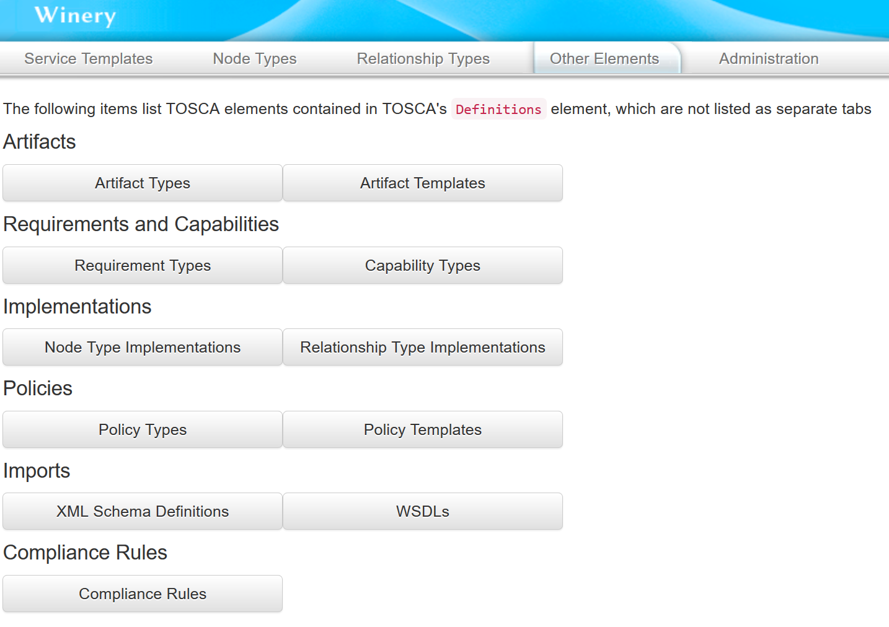

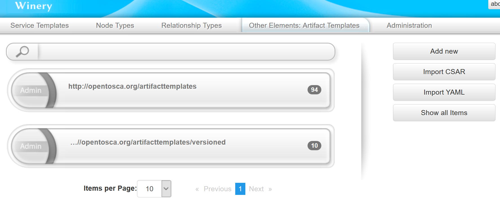

This will open a dialog in which the *Name*, *Versioning*, *Type*, and *Namespace* of the artifact template can be configured. 
Assuming that some artifact types were previously modeled, choose the type *ScriptArtifact*.

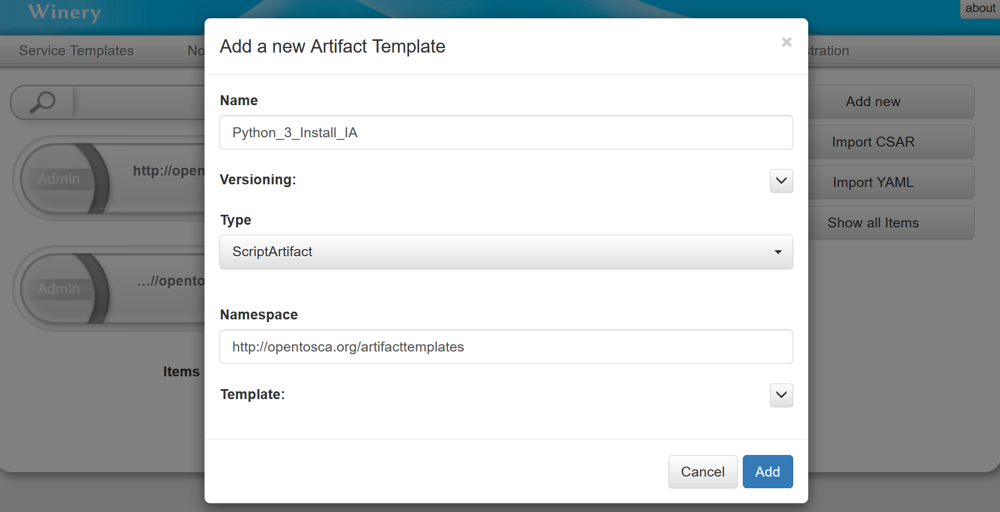

Once the artifact template is created, it can be further configured through different tabs of its detailed view.

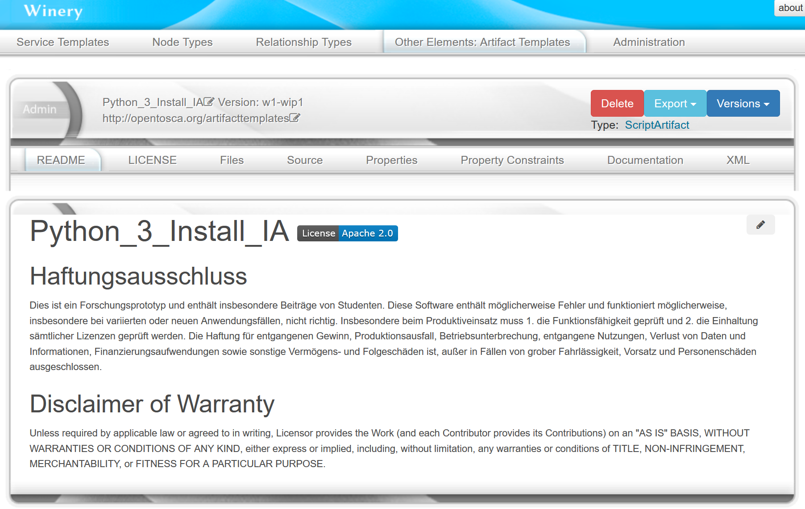

Finally, to load th install script to the artifact template, select the tab *Files*, and drop the file into the drop zone.

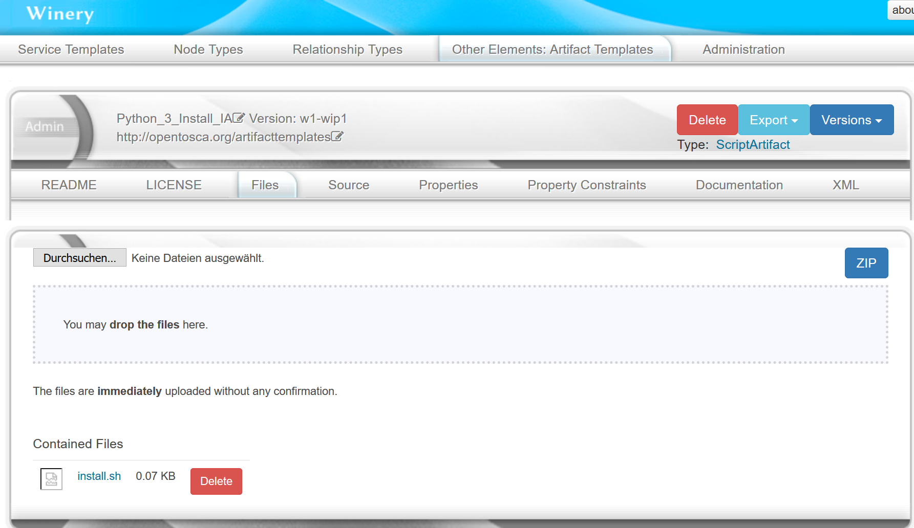

Modeling the Node Type Implementation
*************************************

To create a node type implementation, select the tab *Other Elements*, under the the category *Implementations* select the option *Node Type Implementations*, and press the button *Add new*.
This will open a dialog in which the *Name*, the corresponding node *type*, and *Namespace* of the node type implementation can be configured. By type, select the node type we created before.

.. image:: 12-AddNewNodeTypeImplementation.png
   :width: 600

.. image:: 13-AddNewNodeTypeImplementation.png
   :width: 600

To link the created artifact template to this node type implementation, select the tab *Implementation Artifacts* and press the button *Add*.
In the shown dialog, choose the option *Link Artifact Template*, then select the artifact template that was previously created.

.. image:: 14-AddNewNodeTypeImplementation-LinkArtifactTemplate.png
   :width: 600

.. image:: 15-AddNewNodeTypeImplementation-LinkArtifactTemplate.png
   :width: 600

Modeling the Ubuntu Node Type
*****************************

The modeling of the Ubuntu node type is similar to the modeling of the Python3 node type.

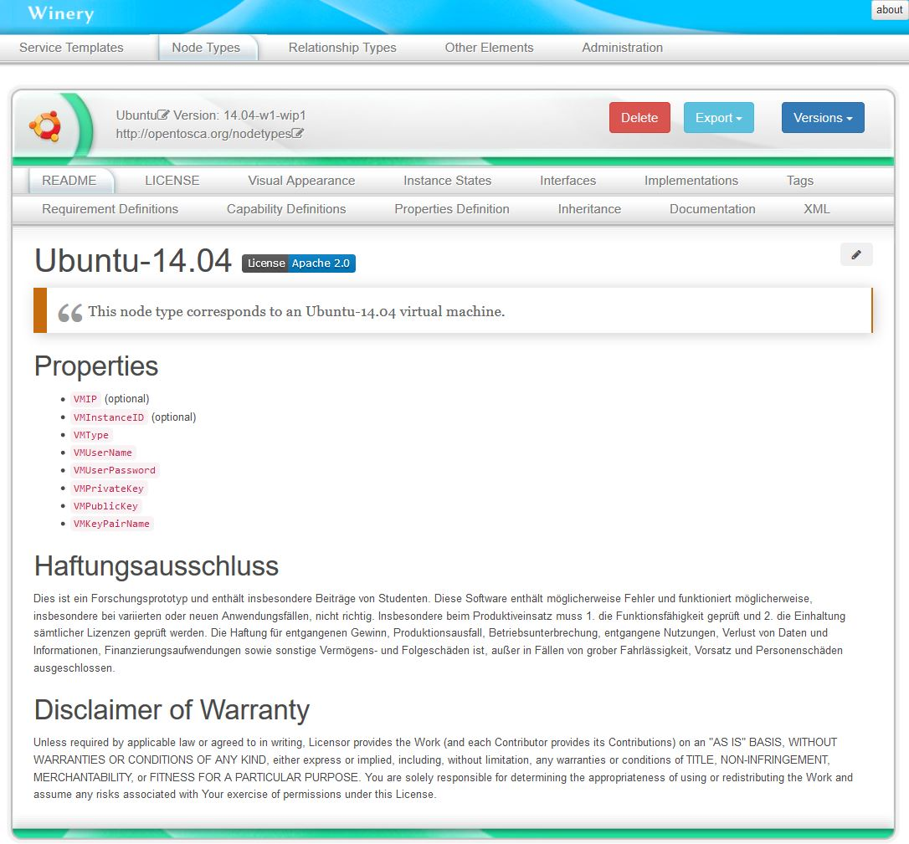

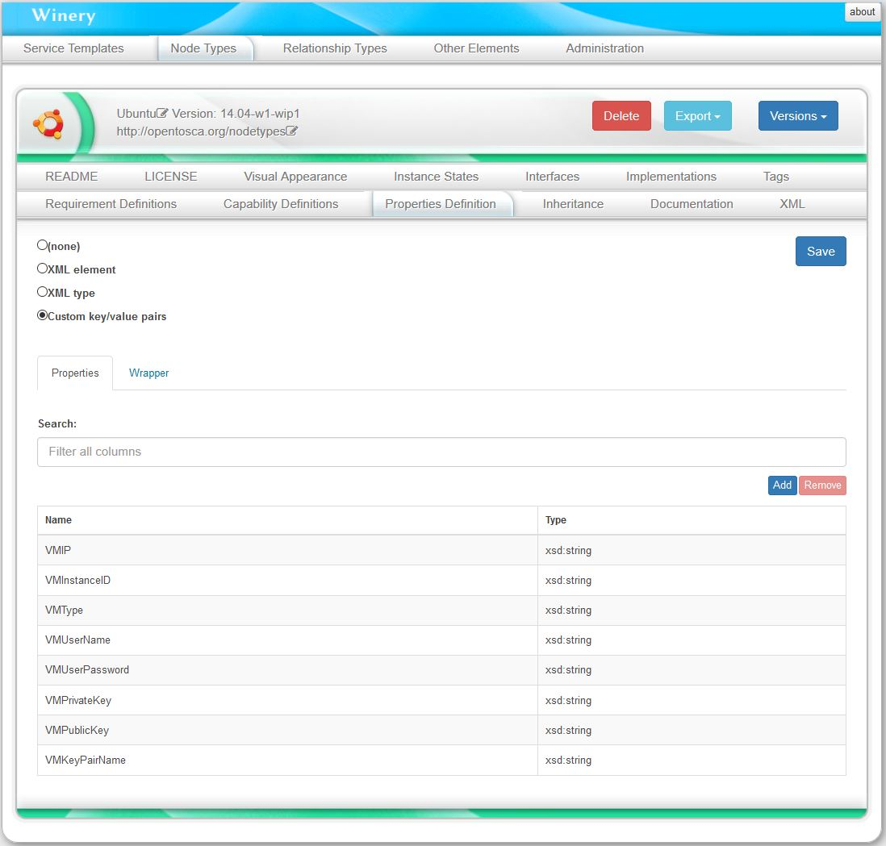

However, the artifact templates for the Ubuntu 14.04 are *.war files* instead of *shell scripts*.
In this case, after defining the *interfaces* and *operations* of the Ubuntu node type, we can automatically generate a stub java maven project to build a *.war file* for a defined interface. 
For this, press *Generate Implementation Artifact*. The node type implementation will be automatically generated as well.

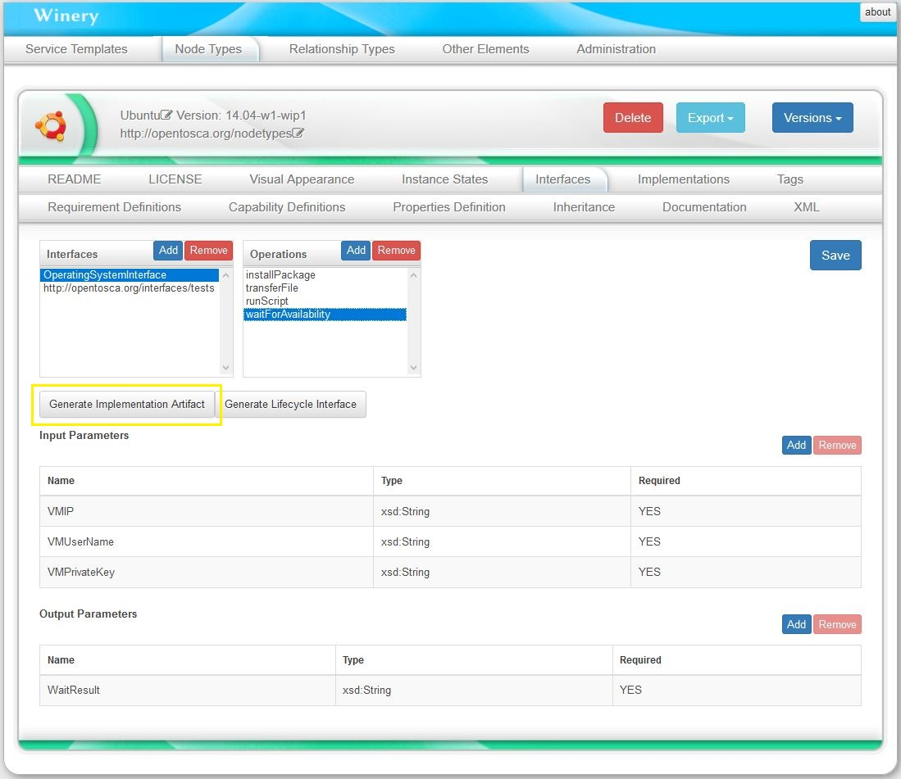

.. image:: 4-AddUbuntuNodeType.jpg
   :width: 600

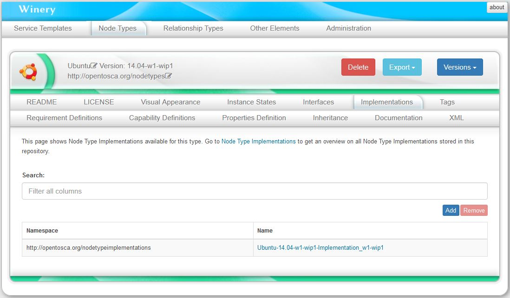

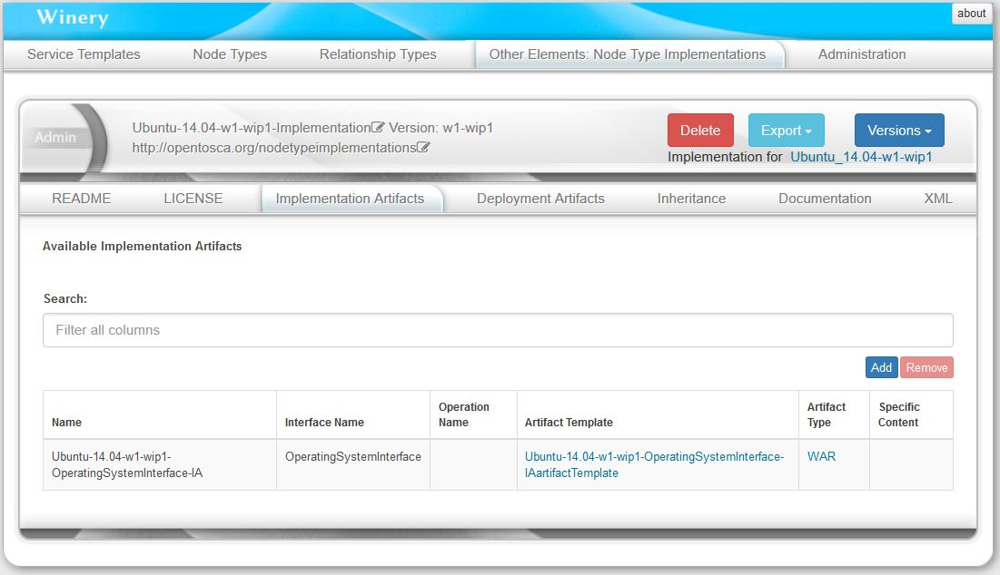

After editing the generated stub project, we can built it and load the resulting .war file to the artifact template in the tab *Files*.

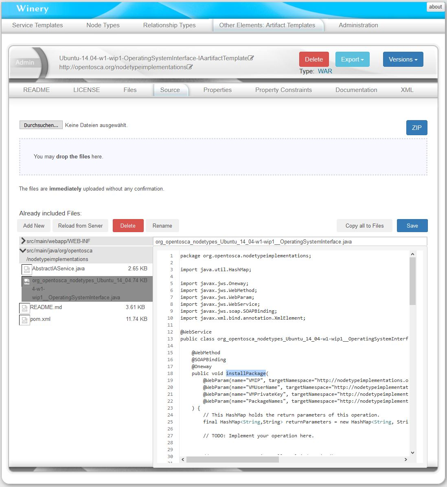

Creating the Service Template
*****************************

To finally model the service template, at the tab *Services Templates*, press *Add new*.

.. image:: 16-AddNewServiceTemplate.jpg
   :width: 600

Go to tab *Topology Template* and press the button *Open Editor*.  

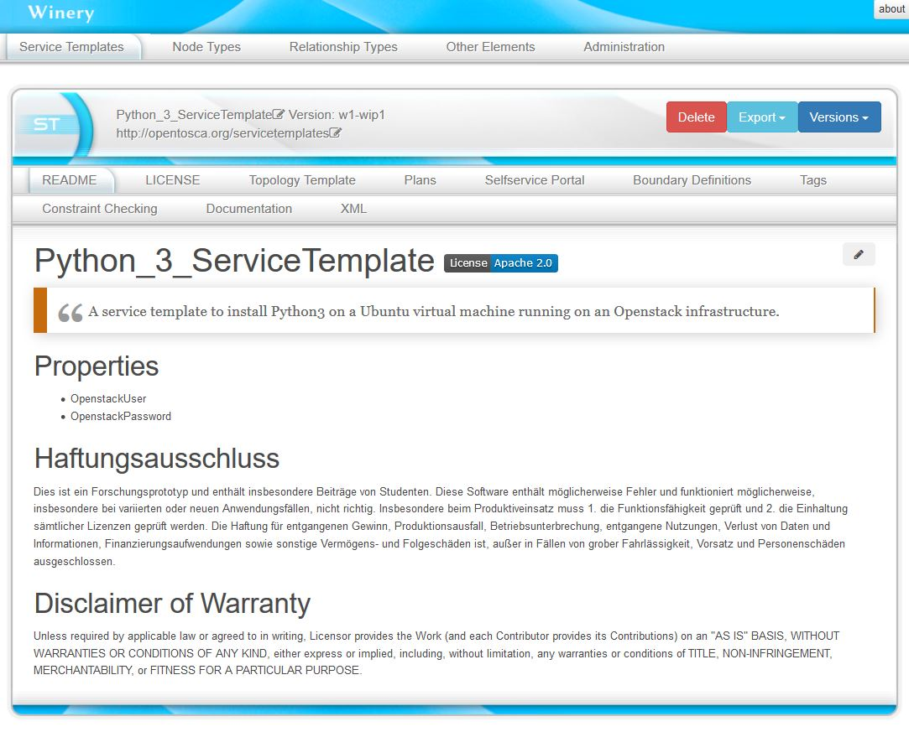

In the editor, the *Palette* on the left shows the available node types, which can be drag and dropped in the modeling area. 

.. image:: 18-AddNewServiceTemplate.jpg
   :width: 600

To model the relationship that the Python3 runtime is hosted on the Ubuntu virtual machine, click at the Python3 node template. 
This will show a list of possible relationship types (previously modeled). Click in the option *HostedOn* and  pull the shown arrow to the Ubuntu node template area, in order to connect these node templates.

.. image:: 19-AddNewServiceTemplate.jpg
   :width: 600

Exporting a Service Template Package
************************************

To export the Service Template as a CSAR package, press *Other*, then *Export CSAR*.

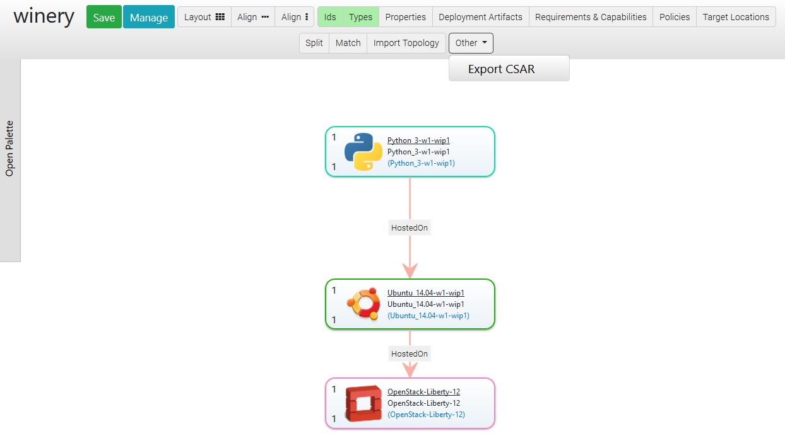

Miscellaneous Notes
*******************

Properties of a Template can be either full XML or key/value based.
If key/value based, a wrapper XML element is required.
Since QNames have to be unique, Winery proposes as namespace the namespace of the template appended by ``propertiesdefinition/winery``.
The name of the wrapper element is ``properties``.

.. note::

   Implementation hint: This is implemented in ``PropertiesDefinitionComponent.onCustomKeyValuePairSelected`` (TS) and ``org.eclipse.winery.model.tosca.TEntityType.getWinerysPropertiesDefinition`` (Java).

Uniqueness of QNames
********************

Intentionally, a QName should be unique within the repository.
We did not follow this assumption, but only require that QNames are unique within a type.
That means, the repository allows ``{http://www.example.org}id`` for both a service template and a node type.
We introduced DefinitionsChildId uniquely identifying a TOSCA element.
Future versions might redesign the backend to use a QName as the unique key.
