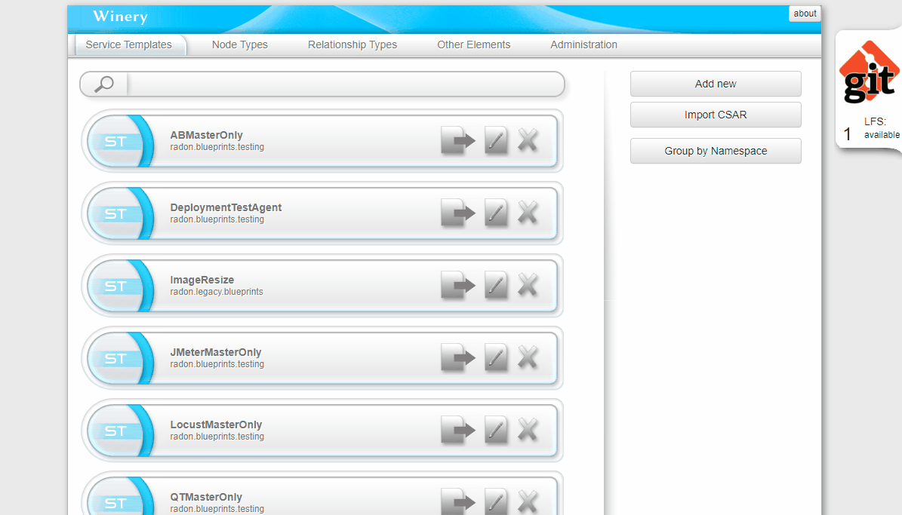
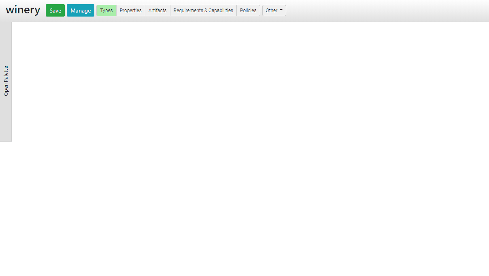
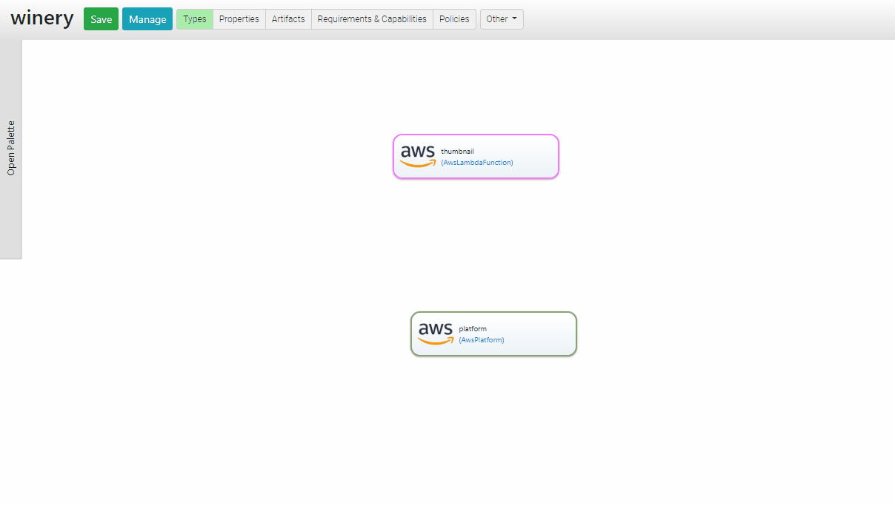
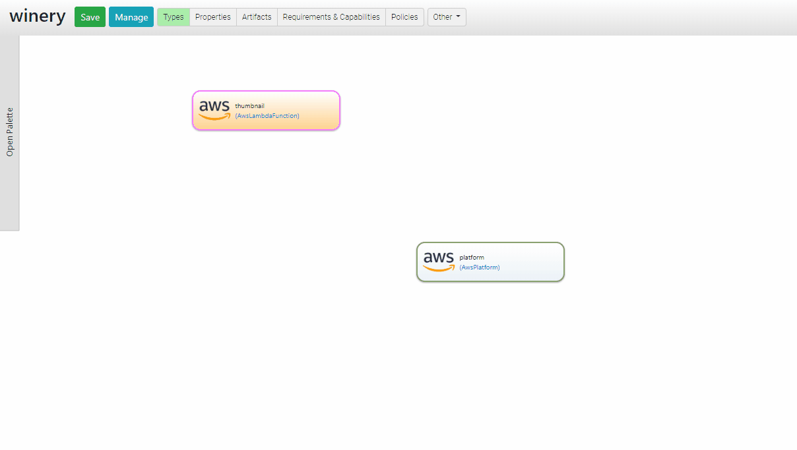
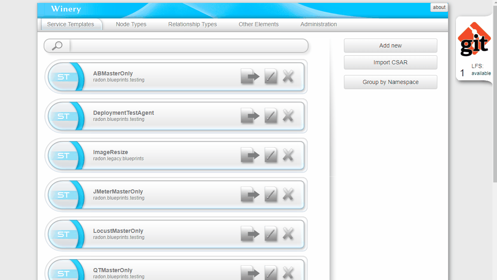

.. Copyright (c) 2020 Contributors to the Eclipse Foundation

.. See the NOTICE file(s) distributed with this work for additional
.. information regarding copyright ownership.

.. This program and the accompanying materials are made available under the
.. terms of the Eclipse Public License 2.0 which is available at
.. http://www.eclipse.org/legal/epl-2.0, or the Apache Software License 2.0
.. which is available at https://www.apache.org/licenses/LICENSE-2.0.

.. SPDX-License-Identifier: EPL-2.0 OR Apache-2.0

Modeling with Winery
####################

Launch a browser and navigate to `<http://localhost:8080>`_.

Modeling an Application
***********************

Eclipse Winery starts in the *Service Template* view.
In this view, users can create new TOSCA service template or maintain existing ones.

To create a new TOSCA service template click on *Add new*.
In the "Add new" pop up you can specify your template's name, enable/disable versioning, and specify the namespace to be used.
For example, you may choose a namespace like ``com.example.blueprints`` to logically group your TOSCA service templates. 

.. warning::
   Do not use spaces in your service template name.
   Use ``_`` or ``-`` to separate names.

In the *Service Template Detail* view you can add some readme text and assign a respective license.
Further, to compose your application open the *Topology Modeler* by ``Topology Template > Open Editor``.

Model Node Templates
--------------------

In the editor, you can drag and drop existing TOSCA node types to the canvas to define a new TOSCA node template.
You can select a modeled node to modify its display name and additional data using the right pane. 

You can change properties or add artifacts by enabling the *Properties* or *Artifacts* view in the header bar. 

Define Relations Between Node Templates
---------------------------------------

Relationships in TOSCA (according to TOSCA YAML 1.3) are modeled using matching *Requirements* and *Capabilities*
(please refer to the standard to get more detailed information or checkout the :ref:`tosca` page).

In the *Topology Modeler*, you can enable the *Requirements & Capabilities* view in the header bar.
Then, open the *Requirements* of the source node and the *Capabilities* of the target node.
Finally, drag a respective relationship type (e.g., ``HostedOn``) from the requirement (e.g., ``host``) to a matching capability (e.g., ``host``). 

Export CSAR
***********

The TOSCA exchange format is a Cloud Service Archive (CSAR).
A CSAR is essentially a ZIP file following a certain directory layout and contains all necessary files and template to execute the deployment of the modeled application.

Open the *Service Template* view.
Search for your service template and open it.
In the *Service Template Detail* view you can click on *Export* either to *Download* the CSAR or to save it to the filesystem (``<repository>/csars`` on your host system).

Node Type Development
#####################

Start Eclipse Winery as described in "Use a custom TOSCA model repository" of the :ref:`Getting Started<_getting_started>` page.
This way, newly created Node Types will be reflected in the filesystem which is mounted into Winery's Docker container.

Before you start, create a new branch: 

.. code-block::

   git checkout -b <name>

You can push this branch to a Git origin to share your work with others or you could propose a pull-request to the original Git repository.
