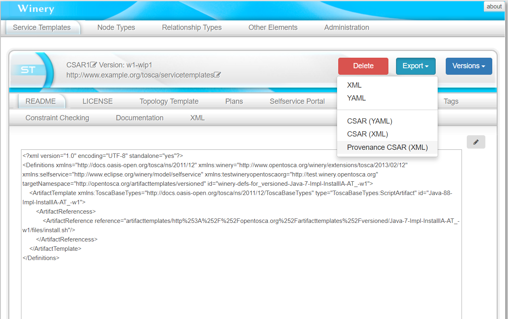
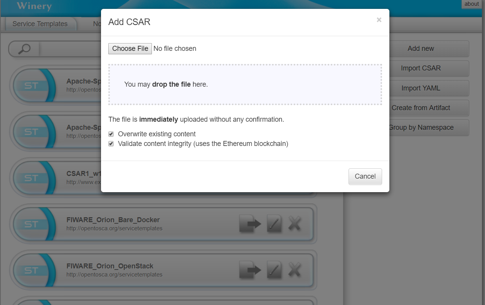
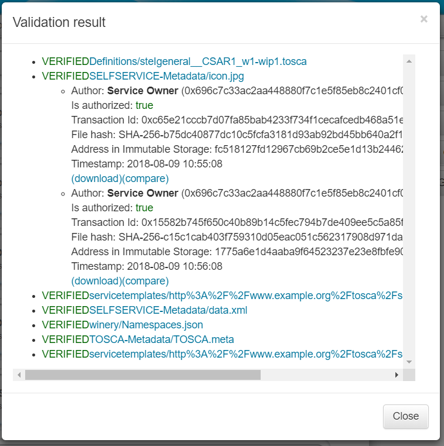
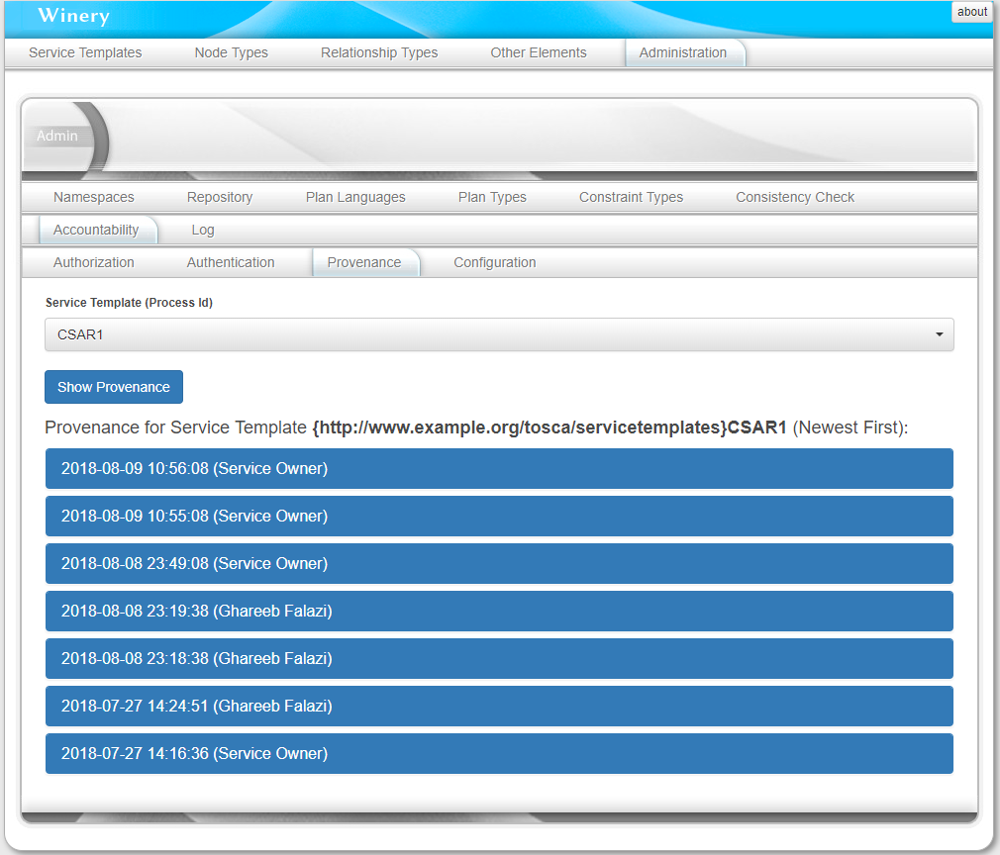
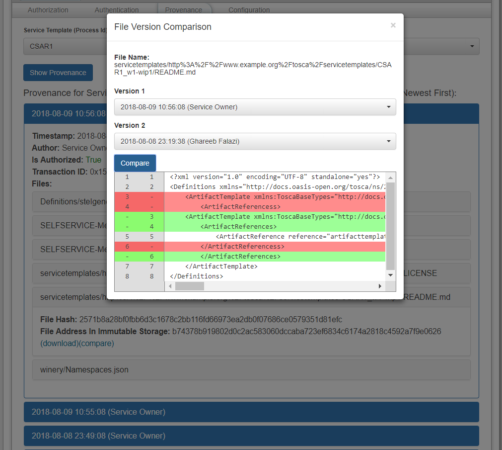

# Decentralized Collaborative Development of Application Deployment Models

[](https://opensource.org/licenses/EPL-2.0)
[](https://opensource.org/licenses/Apache-2.0)

The purpose of this module is facilitating accountability in situations that involve multiple untrusting participants
collaborating to develop a business-critical CSAR, e.g., in a data-analytics scenario.
Accountability is achieved through registering the metadata file (we call it the fingerprint) of each exported CSAR in the Ethereum blockchain.
The metadata file includes enough information about the contents of the CSAR to uniquely identify them and detect if something is
changed.
Furthermore, to facilitate comparing the contents of various versions of a CSAR, these contents are stored at export time in
the Swarm network.
The module also has a blockchain-based authorization mechanism to only allow authorized participants to take part in the
collaborative development process.

This module integrated into the TOSCA modeling tool: [Winery](https://eclipse.github.io/winery/).
Please follow the [user guide](https://eclipse.github.io/winery/user/) to inform yourself about Winery and how to get it running.

## Table of Contents:
- [Configuration](#Configuration)
   - [Running a Local _geth_ Node](#Running-a-Local-_geth_-Node)
   - [Running a Local Swarm Node](#Running-a-Local-Swarm-Node)
- [Major Features](#Major-Features)
   - [Registering Exported CSARs in the Blockchain](#Registering-Exported-CSARs-in-the-Blockchain)
   - [Validating the Integrity of Imported CSARS](#Validating-the-Integrity-of-Imported-CSARS)
   - [Authorizing Users to Particiate in Collaborative CSAR Development](#Authorizing-Users-to-Particiate-in-Collaborative-CSAR-Development)
   - [Checking the Provenance of a CSAR and its Contents](#Checking-the-Provenance-of-a-CSAR-and-its-Contents)
- [Demonstrative Scenarios](#Demonstrative-Scenarios)
   - [Scenario 1: Normal Interaction – The “Happy Path”](#Scenario-1:-Normal-Interaction-–-The-“Happy-Path”)
   - [Scenario 2: Unregistered Changes of the CSAR](#Scenario-2:-Unregistered-Changes-of-the-CSAR)
   - [Scenario 3: Unauthorized Participant](#Scenario-3:-Unauthorized-Participant)
- [License](#License)
 
## Configuration

This module needs to be able to communicate with a [geth node](https://github.com/ethereum/go-ethereum)
which has RPC connections enabled.
Furthermore, the module directly accesses the keystore file holding the private key of an Ethereum account used for sending
and receiving transactions.
Moreover, the module uses two __smart contracts__: [one to manage authorization](src/main/solidity/authorization.sol), and [the other to manage provenance](src/main/solidity/provenance.sol).
These smart contracts need to be deployed to the selected Ethereum network, e.g., Mainnet, Rinkeby, etc., and their addresses need to be entered in the configuration UI (see below).
Deployment can be done with many Ethereum client applications, such as [Ethereum Wallet](https://github.com/ethereum/mist/releases).

On the other hand the module needs to be able to communicate with a [swarm node](https://swarm-guide.readthedocs.io/en/latest/index.html).
A local node is preferred; nonetheless, a [public gateway](https://swarm-gateways.net/) is also available.
Configuration for this feature, e.g., communication with a geth and swarm nodes and the local Ethereum keystore, is provided via one of Winery's admin user interfaces:
 
.

### Running a Local _geth_ Node

A geth node is used to access the Ethereum network. For development purposes, it is advised
not to connect to the main Ethereum network, but rather to one of the testnets.
(another, more difficult option would be to run a local private Ethereum network).
In order to connect a geth node to [Rinkeby](https://www.rinkeby.io) (one of Ethereum testnets), you can follow these steps:

1. [Install geth](https://github.com/ethereum/go-ethereum/wiki/Installing-Geth):
 this differs depending on your operating system.
2. Run geth in the fast-sync mode: This option downlaoads the whole blockchain but does not re-execute all transactions. Syncing
the whole testnet blockchain (which is done once only) takes about 1-4 hours (depending on the hardware, the speed of the network 
connection, and the availability of peers).
To start a geth node in the fast-sync mode, execute the following command:
    ```
    geth --rpcapi personal,db,eth,net,web3 --rpc --rinkeby --cache=2048 --rpcport "8545"
    --bootnodes=
    enode://a24ac7c5484ef4ed0c5eb2d36620ba4e4aa13b8c84684e1b4aab0cebea2ae45cb4d375b77eab56516d34bfbd3c1a833fc51296ff084b770b94fb9028c4d25ccf@52.169.42.101:30303,
    enode://343149e4feefa15d882d9fe4ac7d88f885bd05ebb735e547f12e12080a9fa07c8014ca6fd7f373123488102fe5e34111f8509cf0b7de3f5b44339c9f25e87cb8@52.3.158.184:30303,
    enode://b6b28890b006743680c52e64e0d16db57f28124885595fa03a562be1d2bf0f3a1da297d56b13da25fb992888fd556d4c1a27b1f39d531bde7de1921c90061cc6@159.89.28.211:30303
    ```
    If you want your node to be accessible remotely, apart from configuring your firewall, you also need to use the following extra option,
 when running the node: `--rpcaddr "0.0.0.0"`
3. Test connection: you can test your connection to a running geth node using the following command
(make sure to install geth on the computer where you run this command): `geth attach http://localhost:8545`
please replace `localhost` with the ip address of the computer running the node.

### Running a Local Swarm Node

A swarm node is used to access the swarm distributed storage network.
We access the swarm network through the node's exposed [HTTP API](http://swarm-guide.readthedocs.io/en/latest/apireference.html).
To install and configure a local swarm node follow these steps:

1. [Install swarm](https://swarm-guide.readthedocs.io/en/latest/installation.html#installing-swarm-from-a-package-manager)
2. [Run swarm](https://swarm-guide.readthedocs.io/en/latest/gettingstarted.html#how-do-i-connect-to-swarm). 
  Make sure that the keystore attached to the node contains the same key used for the geth node above.
3. Optional: if you want to configure a swarm gateway on a machine different from the one running this module:
    1. [Install Nginx](https://www.nginx.com/resources/wiki/start/topics/tutorials/install/)
    2. Use the following configuration (see the [post on ethereum stack exchange](https://ethereum.stackexchange.com/questions/8187/how-to-run-a-swarm-gateway)):
     ```
     server {
         server_name my-swarm-gateways.net ;
         listen 80 ;
         client_max_body_size 0;
         location / {
            proxy_pass http://localhost:8500;
         }
     }
     ```
## Major Features

### Registering Exported CSARs in the Blockchain

Registering new CSARs in the blockchain, as well as storing their contents in the decentralized immutable storage, Swarm
happens at export-time using the button entitled "Provenance CSAR (XML)".
The button will not appear if the accountability feature is not configured and enabled (see above):

. 

### Validating the Integrity of Imported CSARS

Validation of CSAR happens automatically at import-time if the accountability feature is configured (see above), and
a specific option is checked in the import CSAR dialog:



After the validation process is over, a summary is shown that allows exploring the contents of the imported CSAR and
viewing the provenance of each contained file, and even download previous versions of it:



### Authorizing Users to Particiate in Collaborative CSAR Development

Authorization of users to work on specific CSARS (service templates) takes place using a sub-UI of the Winery Admin UI.
Here the Ethereum address (0x + 40-places hexadecmial number) is entered along with a human-readable name that is not required to
be unique:


Authorized participants are automatically verified during CSAR-import process.
However, one can manually verify the authenticity of a given participant using a different sub-UI of the Winery Admin UI:


### Checking the Provenance of a CSAR and its Contents

The provenance of a given service template, i.e, the immutable history of versions it went through as well as the authors
of those versions, can be accessed using the "Provenance" UI of the Winery Admin UI.
Here the desired service template id is selected and the button "Show Provenance" is pressed:



When the user clicks on one of the provenance entries, more details are shown including details about each of the files 
contained in this version:


Any of these files can be downloaded using the "(download)" link below it.
Moreover, it can be compared with other versions of it using the "(compare)" link which shows the following dialog:



## Demonstrative Scenarios

__Disclaimer__: some screens that appear in the videos associated with following scenarios correspond to older versions of this module.
However, the functionality presented here is the same in the latest version.

### Scenario 1: Normal Interaction – The “Happy Path”

Please watch the video [here](https://www.youtube.com/watch?v=-hknzv2W1I8)

**Participant 1:**

* Creates a new CSAR and adds a license to it.
* Export the CSAR (this automatically registers it in the blockchain).
* Authorize participant 2.
* Send the CSAR to participant 2.

**Participant 2:**

* Import the CSAR. This automatically:
  * Checks the CSAR integrity, i.e., that it is registered in the blockchain.
  * Checks that participant 1 is authorized.
* Can view the registered history of any component of the CSAR.
* Alters the CSAR by changing the license type.
* Export the CSAR (this automatically registers it in the blockchain).
* Authorize participant 3.
* Send the CSAR to participant 3.

**Participant 3:**

* Import the CSAR. This automatically:
  * Checks the CSAR integrity, i.e., that it is registered in the blockchain.
  * Checks that participants 1 and 2 are authorized.
* Can view the registered history of any component of the CSAR.
  * Can detect which files are changed and which are not.
  * Can download any file from any point in its history (e.g., the two versions of the license)

### Scenario 2: Unregistered Changes of the CSAR

Please watch the video [here](https://www.youtube.com/watch?v=3khEGUWf4oc)

**Participant 1:**

* Manually applies changes in the CSAR – no export.
* Sends it to participant 2.

**Participant 2:**

* Import the CSAR:
  * An error message pops up notifying the user that this version of the CSAR is not registered in the blockchain.
  * The specific altered files are specified, and the history of registered changes can be shown.

### Scenario 3: Unauthorized Participant

Please watch the video [here](https://www.youtube.com/watch?v=w4UdWHeGpRA)

**Participant 1 (unauthorized):**

* Maliciously obtains the CSAR.
* Applies changes to the CSAR.
* Exports the CSAR (this automatically registers it in the blockchain).
* Sends CSAR to participant 2.


**Participant 2:**

* Import the CSAR:
  * An error message pops up notifying the user that the author of this version of the CSAR is not authorized.
  * The user can preview the **history of registered changes** made to the CSAR and **who** made them and whether they are **authorized or not**.
  
## License

Copyright (c) 2018 Contributors to the Eclipse Foundation

See the NOTICE file(s) distributed with this work for additional
information regarding copyright ownership.

This program and the accompanying materials are made available under the
terms of the Eclipse Public License 2.0 which is available at
http://www.eclipse.org/legal/epl-2.0, or the Apache Software License 2.0
which is available at https://www.apache.org/licenses/LICENSE-2.0.

SPDX-License-Identifier: EPL-2.0 OR Apache-2.0

